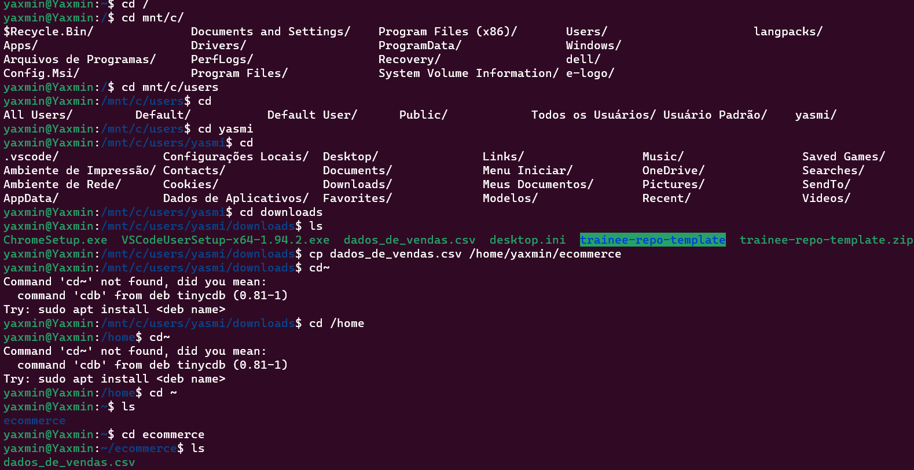
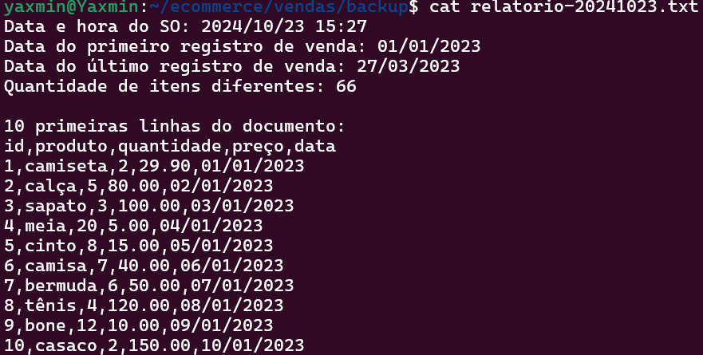
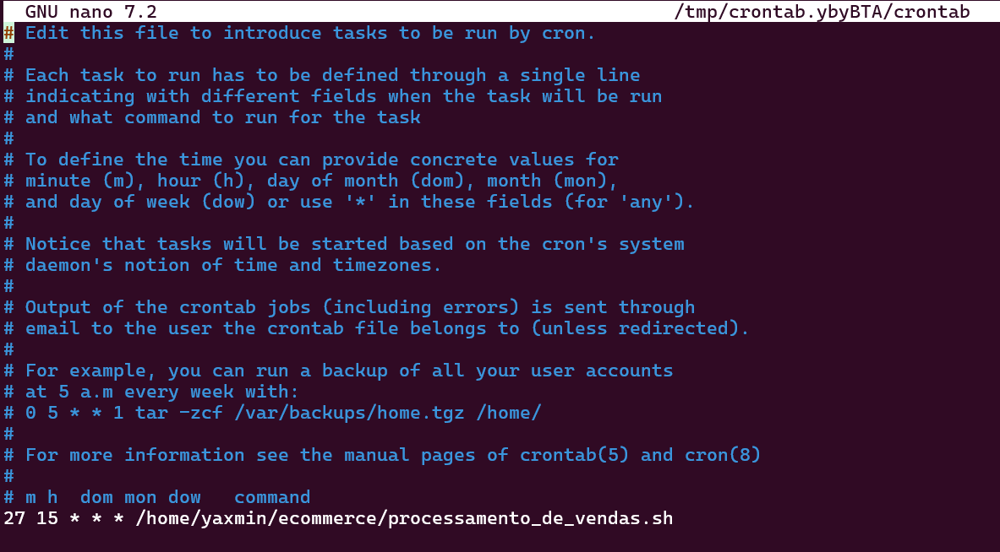
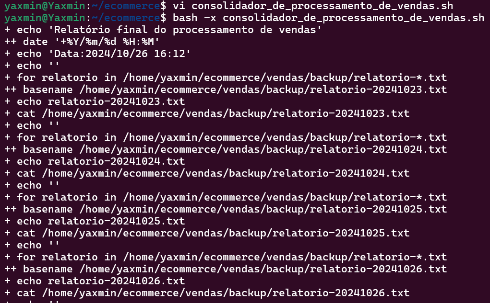

# Objetivo do desafio

Processar e gerar relatórios de vendas (Passo a passo):
- criar um script que gere relatórios de vendas baseado nos dados recebidos;
- agendar a execução para gerar-los em quatro dias no mesmo horário, e trocar os dados para gerar um relatório diferente cada dia;
- criar um segundo script para juntar todos os relatórios em um relatório final.


# Etapas

### **Preparação**:

-  Instalação da VM (Virtual Machine): tentei utilizar a virtual box pra emular o linux, porém obtive problemas por conta do meu PC, por isso utilizei o WSL (Windows Solution for Linux).

- Para a realização do desafio, foi disponibilizado um arquivo chamado "dados_de_vendas.csv" com inormações de id, produto, quantidade, preço e data.

- passando o arquivo csv do windows para o WSL:



___

## 1.  Etapa I

Nessa primeira etapa se encontra o código do Script 1, onde é criado um arquivo executável chamado *processamento_de_vendas.sh*

### Código do Script1: [Etapa I](etapa-1)

Logo na primeira linha do código, é definido o caminho que as pastas e arquivos devem ser criadas, para isso foi usado o comando *export* e definido a variavél PATH indicando o local desejado.

```bash
    export PATH="/usr/local/sbin:/usr/local/bin:/usr/sbin:/usr/bin:/sbin:/bin" 
```

E então foi usado o cd para abrir o diretório *ecommerce*, e criado a variável data que puxa a data atual do SO no formato *yyyymmdd*

```bash
    cd /home/yaxmin/ecommerce

    DATA=$(date +%Y%m%d)
```

criando o subdiretório vendas dentro de ecommerce e copiando o arquivo csv dentro dele

```bash
    mkdir -p vendas
    cp /home/yaxmin/ecommerce/dados_de_vendas.csv /home/yaxmin/ecommerce/vendas/
```

criando o subdiretório backup dentro de vendas

```bash

    mkdir -p vendas/backup
```

logo após foi usado o comando mv para renomear o arquivo csv dentro do diretório vendas, e então copiando o arquivo renomeado no subdiretório backup

```bash
    mv vendas/dados_de_vendas.csv vendas/dados-${DATA}.csv`

    cp vendas/dados-${DATA}.csv vendas/backup/backup-dados-${DATA}.csv
```

Para a criação do relatório já com as informações pedidas dentro dele foi utilizado colchetes "{}", e então o ">" para criar o arquivo .txt e atribuir essas informações ao documento.

```bash
    {
        echo "Data e hora do SO: $(date +%Y/%m/%d\ %H:%M)"
        echo "Data do primeiro registro de venda: $(tail -n +2 vendas/dados-${DATA}.csv | head -n 1 | cut -d ',' -f5)"
        echo "Data do último registro de venda: $(tail -n +2 vendas/dados-${DATA}.csv | cut -d ',' -f5 | sort -t '/' -k3,3 -k2,2 -k1,1 | awk 'END {print}')"
        echo "Quantidade de itens diferentes:" $(tail -n +2 vendas/dados-${DATA}.csv | cut -d ',' -f1 | sort | uniq | wc -l)
        echo ""
        echo "10 primeiras linhas do documento:"
        head -n 11 vendas/dados-${DATA}.csv
    } > vendas/backup/relatorio-${DATA}.txt
```

- detalhando o relatório:

    Para conseguir a data do primeiro registro, é usado o comando **tail -n +2** para ignorar a primeira linha (cabeçalho), e o comando **head -n 1** pega a primeira linha dos registros, e por fim, **cut -d ',' -f5** extrai o quinto campo da linha, ou seja, a data.
    ```bash
        echo "Data do primeiro registro de venda: $(tail -n +2 vendas/dados-${DATA}.csv | head -n 1 | cut -d ',' -f5)"
    ```

    Para conseguir a última data dos registro de venda, foi usado o comando **tail -n +2** para ignorar o cabeçalho, o comando **cut -d ',' -f5** para extrair o quinto campo separado por virgulas da linha, ou seja a data, e então o comando **sort -t '/' -k3,3 -k2,2 -k1,1** que ordena as datas, e por fim, o comando **awk 'END {print}'** para imprimir a última data da lista ordenada.
    ```bash
        echo "Data do último registro de venda: $(tail -n +2 vendas/dados-${DATA}.csv | cut -d ',' -f5 | sort -t '/' -k3,3 -k2,2 -k1,1 | awk 'END {print}')"
    ```

    Para realizar a contagem dos itens desconsiderando duplicatas foi utilizado o comando **cut -d ',' -f2** que extrai o seundo campo dividido por virgulas de cada linha do arquivo (nome do produto), o comando **sort** organiza os produtos em ordem alfabética, o comando **uniq** remove linhas duplicadas consecutivas mantendo somente uma unidade, e por fim, o comando **wc -l** conta o número de linhas, e consequentemente a quantidade de itens únicos na lista
    ```bash
        echo "Quantidade de itens diferentes:" $(tail -n +2 vendas/dados-${DATA}.csv | cut -d ',' -f1 | sort | uniq | wc -l)
     ```
        
    E então, foi utilizado o comando head -n 11 para conseguir mostrar o cabeçalho e as 10 primeiras linhas de registros de vendas do documento csv
    ```bash
        head -n 11 vendas/dados-${DATA}.csv
    ```


E por fim, compactando o arquivo dados de vendas com o nome modificado atravéz do comando *zip* e removendo arquivos desnecessários 

```bash
    zip /home/yaxmin/ecommerce/vendas/backup/backup-dados-${DATA}.zip vendas/backup/backup-dados-${DATA}.csv

    rm -r vendas/backup/backup-dados-${DATA}.csv
    rm -r vendas/dados-${DATA}.csv

    #fim do script
```

[...]

### Depuração

Após criar o código do script realizei a depuração dele pelo próprio terminal utilizando o comando:
```bash
bash -x processamento_de_dados.sh
```

E depois de muitos testes e reajustes de sintaxe consegui executar-lo como esperado, obtive as pastas, arquivos solicitadas e o relatório com as informações pedidas:
  


[...]

### Agendamento

E então programei o crontab para agendar a execução do script nos 4 dias pedidos pelo desafio. Abrindo o editor do crontab:
```bash
crontab -e
```
dentro do editor foi configurado para rodar o arquivo sh para executar durante 4 dias ás 15:27.

 - Como eu tive alguns problemas com o editor crontab, principalmente no momento de setar os dias da semana em que ele deveria rodar, então minha solução para isso foi deixar como a semana toda como indica a imagem abaixo:

 

[...]

### Troca de dados e resultados

Durante esses dias de execução, era necessário fazer a troca dos dados de vendas do arquivo csv manualmente, mantendo a mesma estrutura, porém com produtos, e informações diferentes.

Para isso, pedi para o CHATGPT gerar três listas diferentes com a mesma estrura, e então, sempre que o ultimo relatorio executava eu mudava os dados para o dia seguinte.

O Script executou quarta, quinta, sexta e sábado. Obteve os segundos documentos:

| Dia | Relatórios Gerados| Arquivo compactado |
|---|----|----|
| 1 | [Relatório 23-10-2024](../Evidencias/relatorio-20241023.txt) | [Backup 23-10-2024](../Evidencias/backup-dados-20241023.zip) |
| 2 | [Relatório 24-10-2024](../Evidencias/relatorio-20241024.txt) | [Backup 24-10-2024](../Evidencias/backup-dados-20241024.zip) |
| 3 | [Relatório 25-10-2024](../Evidencias/relatorio-20241025.txt) | [Backup 25-10-2024](../Evidencias/backup-dados-20241025.zip) |
| 4 | [Relatório 26-10-2024](../Evidencias/relatorio-20241026.txt) | [Backup 26-10-2024](../Evidencias/backup-dados-20241026.zip) |


[...]

___

## 2. Etapa II

Por fim, foi feito um segundo script chamado consolidador_de_processamento_de_vendas.sh para juntar os relatórios gerados em um relatório final.

### Código do Script: [Etapa II](etapa-2)

Utilizando colchetes e o comando ">" seguido do caminho desejado para a criação do arquivo e já atribuir-lo o cabeçalho com as informações do arquivo relatorio_final.txt

```bash
{
	echo "Relatório final do processamento de vendas"
	echo "Data:$(date +%Y/%m/%d\ %H:%M )"
	echo ""
} > /home/yaxmin/ecommerce/vendas/backup/relatorio_final.txt
```

Utilizando o comando **for** para criar um loop que procura arquivos que seguem o padrão "relatorio-*.txt" dentro do diretório *backup*
```bash
for relatorio in /home/yaxmin/ecommerce/vendas/backup/relatorio-*.txt; do
	{
		echo $(basename "$relatorio")
		cat $relatorio
		echo ""
		echo "============================================================="
	} >> /home/yaxmin/ecommerce/vendas/backup/relatorio_final.txt
done
```
- detalhando o loop

    Loop que procura, dentro do diretório backup, arquivos que começam com relatorio- e terminam com .txt, e todos os arquivos que ele achar nesses critérios será atribuido a variável relatorio
    ```bash
    for relatorio in /home/yaxmin/ecommerce/vendas/backup/relatorio-*.txt; do
    ```

    Para identificar os relatórios antes de imprimi-los é usado o comando basename para obter apenas o nome do arquivo, sem o caminho, e imprime esse nome no documento
    ```bash
    echo $(basename "$relatorio")
    ```

    Comando que lê e mostra o conteúdo dos relatórios dentro do arquivo
    ```bash
    cat $relatorio
    ```

    Fecha o bloco de comandos, e atribui o seu resultado no relatório final, sendo o comando ">>" usado para adicionar ao final do arquivo
    ```bash
    } >> /home/yaxmin/ecommerce/vendas/backup/relatorio_final.txt
    ```

    Finalizando o loop e o Script
    ```bash
    done

    # fim do script
    ```


[...]

### Depuração

Assim como na primeira etapa, a depuração e teste do código foi feito pelo terminal do próprio Linux.




[...]

### Resultados

- [Relatório final](../Evidencias/relatorio_final.txt)


    


