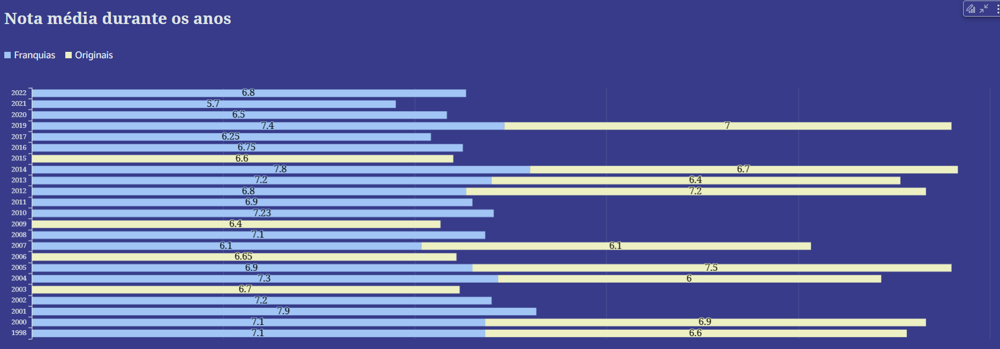

# Objetivo da Entrega 5

Consumo dos dados: criar um dashboard com gráficos que respondam as perguntas previamente desenvolvidas e extrair os insights dessas informações.

Entregáveis:

- imagens e explicação do dashboard criado no Quicksight

- evidências do desenvolvimento do desafio

[...]

# Minha análise

Como o meu grupo (Squad 01) recebeu os generos *Animação e Comédia* para abordar na análise final, eu decidi trazer os filmes de uma produtora que marcou a minha infância e é bem famosa pelos seus filmes de animação e comédia: a **DreamWorks Animation**.

Para guiar a minha análise, eu decidi trazer um tema pertinente e discutivel para produtoras de filmes que fazem tanto sucesso, como os filmes originais e franquias se diferem em diversos aspectos, sejam eles mo sucesso com o pblico geral ou a sua rentabilidade para a empresa

Ao final, minhas perguntas para a análise ficaram assim:

- "Quais são os filmes da DreamWorks com maior bilheteria?"

- "A bilheteria média de histórias originais é maior ou menor que a de continuações?"

- "Qual o retorno sobre investimento (ROI) médio de histórias originais e continuações?"

- "Histórias originais x franquias: qual têm a melhor avaliação?"

- "Como o interesse pelas franquias mudam ao longo do tempo conforme novas sequências são lançadas?"

[...]

# Dashboard - Construção dos Gráficos e KPI's

Dashoboard: **Filmes da DreamWorks Animation - [Originais x Franquias](../Desafio/entrega-5/dashboard_desafio_final.pdf)**

Eu iniciei o dash com algumas métricas dos dados que usei para a análise, utilizando KPI's para melhorar a visualização.

- Total de filmes - somei o campo "filme_id" onde estão todos os titulos da dreamworks.

- Filmes Originais (total) - para cálcular somente os filmes que são originais, ou seja, não possuem uma franquia, criei um campo calculado:

- Qtd. Franquias - para calcular a quantidade de franquias somente somei o campo "nome_colecao".

- Filmes Franquias (total) - utilizai a mesma formula que o do campo calculado de filmes originais somente trocando o "0" para "1" que informa que o filme é uma franquia:

[...]

Como a maioria dos gráficos terá uma diferenciação visual da quantidade entre filmes originais e franquias criei um campo calculado chamado "classificação" onde nomeio esse campo "filme_continuação" que está como "0" caso o filme não esteja em uma coleção e "1" para aqueles que estão:

E adicionei um gráfico de contextualização, trazendo a quantidade de filmes lançados por ano e diferenciando se ele é original ou franquia. Para isso, utilizei um gráfico de barras empilhadas para facilitar a difernciação pelos anos.

[...]

Para o segundo gráfico trouxe quais são os TOP filmes de maior bilheteria da produtora, agrupando os dados pela cassificação criada anteriormente, respondendo  a primeira das perguntas criadas para a análise. *"Quais são os filmes da DreamWorks com maior bilheteria?"*

[...]

Sobre a pergunta "*A bilheteria média de histórias originais é maior ou menor que a de continuações?*" trouxe um gráfico de pizza com a média da receita dos filmes como o valor e agrupando os dado pelo campo calculado que informa a classificação do filme (originais x franquias)

[...]

Para responder a pergunta "*Qual o retorno sobre investimento (ROI) médio de histórias originais e continuações?*" primeiramente criei um campo calculado do Retorno sobre o Investimento antes de criar o gráfico:

E então utilizei um gráfico de barras simples, adicionando no eixo x o campo de classificação para difernciar as dos categorias, e a média do  campo calculado ROI como o valor:

[...]

Trouxe um gráfico de dispersão para fazer a transição entre o assunto de lucratividade para avaliação com uma relação de bilheteria e avaliação onde cada bolinha é um filme e o tamanho delas depende da nota média desse filme, e novamente agrupei os filmes pela classificação originais x franquias

[...]

Gráfico de barras que responde a pergunta: "*Histórias originais x franquias: qual têm a melhor avaliação?*" trazendo as notas médias de filmes originais e franquias

[...]

Adicionei um gráfico de barras empilhadas que traz a nota média dos filmes durante os anos e agrupando pela classificação

[...]

E por fim, respondendo a pergunta: "*Como o interesse pelas franquias mudam ao longo do tempo conforme novas sequências são lançadas?*" com um gráfico de linhas 

[...]

# Storytelling & Insights

A partir do primeiro gráfico é possível notar a diminuição de lançamentos para filmes originais nos últimos 6 anos

E o segundo gráfico trás uma resposta bem clara para essa diminuição, os top 14 filmes de maior bilheteria são Franquias

E numa média geral, as Franquias possuem uma média de bilheteria de quase 2/3 sobre os filmes originais

E a média do Retorno sobre o investimento ((receita - orçamento) / orçamento) dos filmes traz notavelmente que a retenção das franquias é quase o dobro dos filmes originais

Apesar dessa disparidade nos lucros desses filmes, a média de notas dos dois tipos são bem parecidos, o que pode ser um aspécto positivo para os filmes originais, e até gerar possibilidades de continuações para eles

Apesar de tudo, com o passar dos anos e lançamentos de continuações das franquias, o interesse nesses filmes vem perdendo bastante com o desgaste e uso execivo desses produtos como forma de ganhar com lucro gerado por eles, o que pode trazer futuros problemas com o sucesso e 
deteriorar com a reputação da empresa e liberdade criativa dela.

