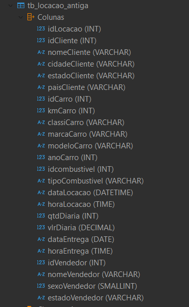
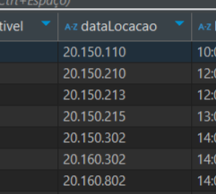
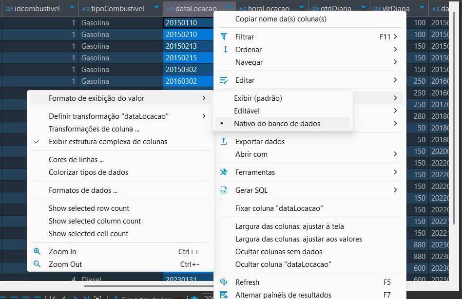
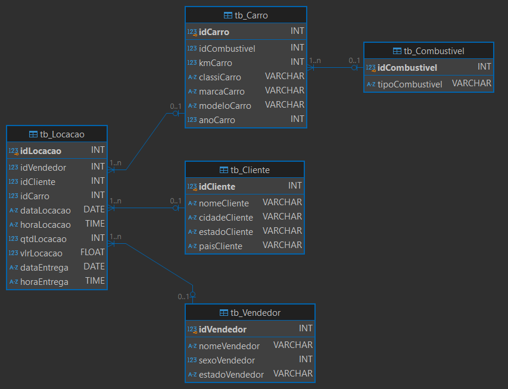
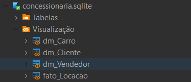
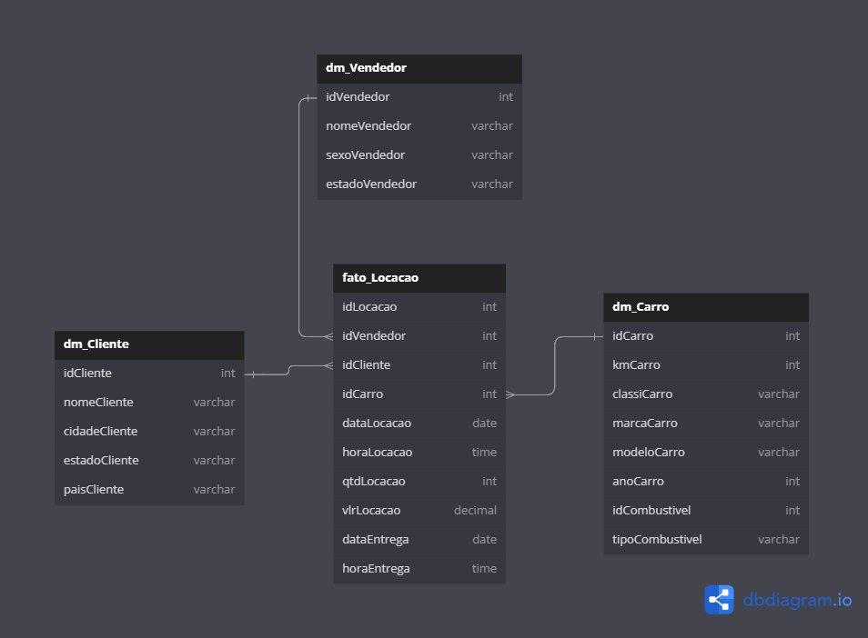

# Objetivo do desafio

Objetivo: prática de conhecimento de modelagem de dados relacional e dimencional. Dividido em duas etapas e entrgáveis
- Normalização do banco de dados e diagrama da modelagem relacional;
- Realizar a modelagem dimencional baseada na relacional e criar um diagrama dela.


# Etapas

### **Preparação**:

- Baixei o arquivo "concessionaria.sqlite"

- Utilizei o Dbeaver (cliente SQL) para fazer os exercícios e o desafio, como indicado

- Havia uma grande tabela chamada "tb_locacao" e decidi renomea-la para tb_locacao_antiga antes de iniciar a normalização

   

___

## 1.  Etapa I

**Normalização e tratamento dos dados**

Assim que consultei a tabela completa e analizei as colunas, notei que havia uma inconsistência nas datas:



primeiramente, decidi habilitar a vizualização original do banco de dados para obter as data no formato YYYYMMDD:



e então criei uma query para alterar a formatação das datas para YYYY-MM-DD usando o comando UPDATE para atualizar a tabela, e o comando SUBSTRING para manipular as strings e adicionar os hífens:

```sql
UPDATE tb_locacao_antiga 
SET dataLocacao = SUBSTRING(dataLocacao, 1, 4) || '-' || SUBSTRING(dataLocacao, 5, 2) || '-' || SUBSTRING(dataLocacao, 7, 2),
	dataEntrega = SUBSTRING(dataEntrega , 1, 4) || '-' || SUBSTRING(dataEntrega , 5, 2) || '-' || SUBSTRING(dataEntrega , 7, 2)
```

[...]

Mais a frente, também notei que os carros possuíam mais de um valor de kilometragem, o que estava causando algumas dificuldades no momento de criação das novas tabelas. Para melhorar isso, no momento da inserção dos dados na nova tabela, decidi filtrar e utilizar somente o maior valor de km de cada carro, para não haver mais repetições de informações.

[...]

No momento da segunda etapa da normalização (fn2) seria necessário segregar a tabela locação antiga, então decidi dividi-la a partir dos id's de identificação como chave primária (pk) das entidades (ex: carro, combustível, cliente, vendedor) e relacioná-las utilizando chaves estrangeiras (fk) na tabela locação.

[...]

**Código**: [criação das tabelas relacionais](../Desafio/etapa-1/tabelas-relacionais.sql)


Procurando sobre relacionamento de tabelas no sqlite, aprendi que a ativação dessa instrução é essencial para a verificação de integridade referencial das chaves estrangeiras, evitando problemas no momento de inserir atualizar e deletar dados das tabelas
```sql
-- Ativando o suporte para chaves estrangeiras
PRAGMA foreign_keys = ON;
```


e então iniciei a criação das tabelas por entidade, utilizando o id como chave primária e identificador. 
Criação da tabela vendedor e inserindo os atributos dessa entidade:
```sql
CREATE TABLE IF NOT EXISTS tb_Vendedor (
   idVendedor INT PRIMARY KEY,
   nomeVendedor VARCHAR,
   sexoVendedor INT,
   estadoVendedor VARCHAR
);
```


utilizei o comando IF NOT EXIST na criação das tabelas para garantir que não se repetisse caso essa ação já tivesse sido realizada. 
Criando a tabela cliente utilizado o id como chave primária:
```sql
CREATE TABLE IF NOT EXISTS tb_Cliente (
   idCliente INT PRIMARY KEY,
   nomeCliente VARCHAR,
   cidadeCliente VARCHAR,
   estadoCliente VARCHAR,
   paisCliente VARCHAR
);

```


originalmente, pensei em juntar essa tabela combustível com o carro, porém após pensar em dividir as entidades baseadas nos ids, decidi manter o padrão e separar o carro e combustível
```sql
CREATE TABLE IF NOT EXISTS tb_Combustivel (
   idCombustivel INT PRIMARY KEY,
   tipoCombustivel VARCHAR
);
```

apesar de dividir o combustível e o carro em tabelas diferentes, a informação do tipo de combustível ainda faz parte dos atributos da entidade carro, então, referenciei o id dele com uma chave estrangeira dentro da tb_carro: 
```sql
CREATE TABLE IF NOT EXISTS tb_Carro (
   idCarro INT PRIMARY KEY,
   idCombustivel INT,
   kmCarro INT,
   classiCarro VARCHAR,
   marcaCarro VARCHAR,
   modeloCarro VARCHAR,
   anoCarro INT,
   FOREIGN KEY (idCombustivel) REFERENCES tb_Combustivel(idCombustivel)
);
```


e então criei a tabela locação com seus atributos, e utilizei os id's das outras tabelas como chaves estrangeiras para referncia-las ao invez de colocar todas as informações como a tabela locação original recebida 
```sql
CREATE TABLE IF NOT EXISTS tb_Locacao (
   idLocacao INT PRIMARY KEY,
   idVendedor INT,
   idCliente INT,
   idCarro INT,
   dataLocacao DATE,
   horaLocacao TIME,
   qtdLocacao INT,
   vlrLocacao FLOAT,
   dataEntrega DATE,
   horaEntrega TIME,
   FOREIGN KEY (idVendedor) REFERENCES tb_Vendedor(idVendedor),
   FOREIGN KEY (idCliente) REFERENCES tb_Cliente(idCliente),
   FOREIGN KEY (idCarro) REFERENCES tb_Carro(idCarro)
);
```


Após a criação das tabelas relacionais foi necessário inserir/copiar as informaçõs da tabela orignal nas novas. Para isso, utilizei o comando INSERT INTO, e SELECT DISTINCT para não haver informações duplicadas
```sql
INSERT INTO tb_Vendedor (idVendedor, nomeVendedor, sexoVendedor, estadoVendedor)
SELECT DISTINCT idVendedor, nomeVendedor, sexoVendedor, estadoVendedor
FROM tb_locacao_antiga 
WHERE idVendedor IS NOT NULL;
```


inserindo dados na tabela cliente
```sql
INSERT INTO tb_Cliente (idCliente, nomeCliente, cidadeCliente, estadoCliente, paisCliente)
SELECT DISTINCT idCliente, nomeCliente, cidadeCliente, estadoCliente, paisCliente
FROM tb_locacao_antiga
WHERE idCliente IS NOT NULL;
```


inserindo dados na tabela combustível
```sql
INSERT INTO tb_Combustivel (idcombustivel, tipoCombustivel)
SELECT DISTINCT idcombustivel, tipoCombustivel
FROM tb_locacao_antiga
WHERE idcombustivel IS NOT NULL;
```

inserindo dados na tabela carro. Como citei anteriormente, havia um problema com as kilometragens repetidas, então adicionei uma condição em que mantem somente o registro mais recente de cada carro, baseado no seu id

```sql
INSERT INTO tb_Carro (idCarro, idCombustivel, kmCarro, classiCarro, marcaCarro, modeloCarro, anoCarro)
SELECT  idCarro, idcombustivel, kmCarro, classiCarro, marcaCarro, modeloCarro, anoCarro
FROM tb_locacao_antiga
WHERE idCarro IS NOT NULL
  AND (idCarro, kmCarro) IN (
       SELECT idCarro, MAX(kmCarro)
       FROM tb_locacao_antiga
       GROUP BY idCarro
     );
```


inderindo dados na tabela locação
```sql
INSERT INTO tb_Locacao (idLocacao, idVendedor, idCliente, idCarro, dataLocacao, horaLocacao, qtdLocacao, vlrLocacao, dataEntrega, horaEntrega)
SELECT  idLocacao, idVendedor, idCliente, idCarro, dataLocacao, horaLocacao, qtdDiaria, vlrDiaria, dataEntrega, horaEntrega
FROM tb_locacao_antiga
WHERE idLocacao IS NOT NULL;
```


e por fim coloquei consultas as novas tabelas
```sql
-- consulta das novas tabelas:

SELECT * FROM tb_Vendedor tv

SELECT * FROM tb_Cliente tc

SELECT * FROM tb_Combustivel tc

SELECT * FROM tb_Vendedor tv

SELECT * FROM fato_Locacao fl

SELECT * FROM tb_Carro tc
```


[...]


### Diagrama Relacional

O próprio Dbeaver oferece a opção de visualizar o diagrama das tabelas, então somente ativei a função de crow's foot para ver o tipo de relação entre as tabelas e então exportei a imagem.




[...]


___

## 1.  Etapa II
    
A segunda etapa tinha o objetivo de modelar dimensionalmente as tabelas relacionais, para isso, decidi seguir com a indicação do video do desafio e criar views para dimensionar as tabelas da melhor forma para consultas.

**Código**: [criação das views](../Desafio/etapa-2/views-dimencional.sql)


Então usei o comando CREATE VIEW e o nome da tabela e selecionar os atributos com SELECT & FROM para criação dessas views. E utilizei dm antes dos nomes para diferenciar das tabelas(tb)
```sql
CREATE VIEW dm_Cliente AS
SELECT
	idCliente,
	nomeCliente,
	cidadeCliente,
	estadoCliente,
	paisCliente
FROM tb_Cliente tc;
```


criando a view vendedor
```sql
CREATE VIEW dm_Vendedor AS
SELECT
	idVendedor,
	nomeVendedor,
	sexoVendedor,
	estadoVendedor
FROM tb_Vendedor tv;
```

criando a view carro e usando join para juntar com a tabela combustível
```sql
CREATE VIEW dm_Carro AS
SELECT 
    tc.idCarro,
    tc.kmCarro,
    tc.classiCarro,
    tc.marcaCarro, 
    tc.modeloCarro,
    tc.anoCarro,
    tc.idCombustivel, 
    combustivel.tipoCombustivel
FROM tb_Carro tc
JOIN tb_Combustivel combustivel ON tc.idCombustivel = combustivel.idCombustivel;
```


criando a view locação
```sql
CREATE VIEW fato_Locacao AS
SELECT
	idLocacao,
	idVendedor,
	idCliente,
	idCarro,
	dataLocacao,
	horaLocacao,
	qtdLocacao,
	vlrLocacao,
	dataEntrega,
	horaEntrega
FROM tb_Locacao tl;
```


e por fim, coloqueis as querrys de consulta das views criadas
```sql
-- consultas das views criadas:
SELECT * FROM dm_Cliente

SELECT * FROM dm_Vendedor

SELECT * FROM dm_Carro dc 

SELECT * FROM fato_Locacao
```

[...]

views no Dbeaver:




### Diagrama Dimencional

Como o Dbeaver não utiliza as chaves para relacionar as views criadas, optei por realizar o diagrama relacionando as views usando o **dbdiagram.io**. [(link  do site)](https://dbdiagram.io/home)




