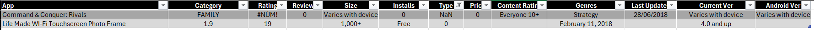
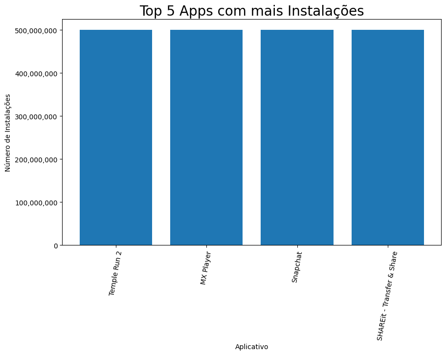
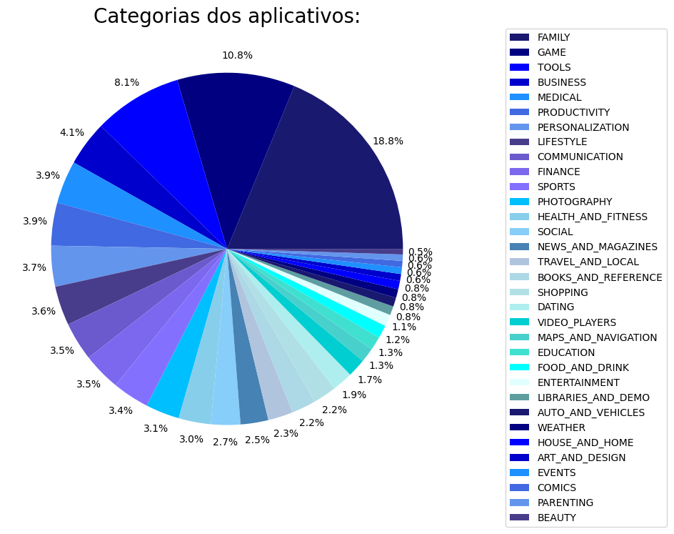
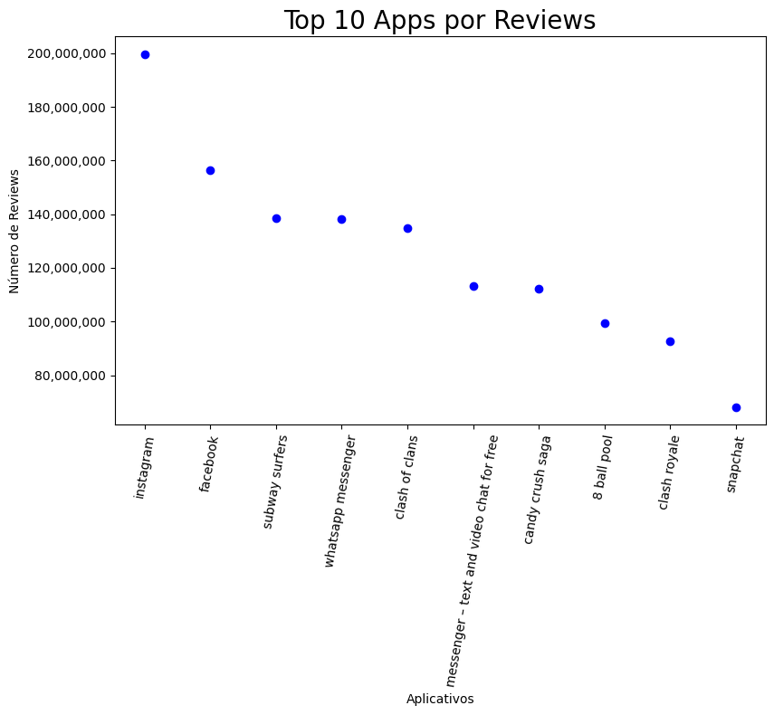
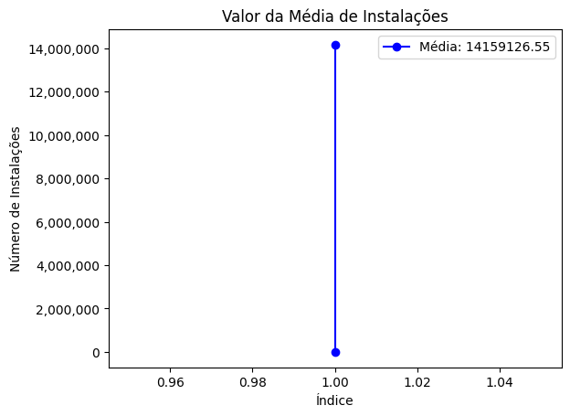

# Objetivo do desafio

**OBJETIVO**: ler o arquivo de estátistica da Loja do Google “googleplaystore.csv”, processar e gerar gráficos de análise. *(instalar as bibliotecas Pandas e Matplotlib para isso)*

**ENTREGÁVEIS**:

- Arquivo no formato .IPYBN contendo o código no modelo de notebook, com execução realizada:
    - instalar a extenção do Jupyter no VS Code e gerar o arquivo com o formato .IPYNB

- incluir celulas em markdown com documentação de cada célula de código criado


# Etapas

 --> [Código do Desafio](../Desafio/etapa-1/desafio.ipynb) - Ao total, ele foi dividido em 8 etapas diferentes.

*A descrição tecnica do código foi feita no próprio markdown do arquivo, então decidi trazer o meu pensamento lógico na tomada de decisão em cada etapa.*

### Preparação:

- baixei o arquivo googleplay.csv
- abri o arquivo no excel para dar uma analizada por cima
- como estava usando o VS Code, preparei o ambiente baixando as extenções do Jupyter notebook

A partir da analise prévia no excel já notei alguns valores estranhos, e como eu dei uma lida nas etapas do desafio, já fui dando uma olhada nas colunas que iria trabalhar e fiz algumas filtragens para ver o que saia do padrão. Com isso, notei que a coluna "Type" tinha somente duas linhas que divergiam do seu padrão, e como essa coluna seria usada como parametro para algumas etapas futuras, já tinha em mente que seria uma boa ideia eliminá-las.




### Etapa 1

**Objetivo**: Ler o arquivo googlestore.csv utilizando o pandas e remover linhas duplicadas.

- Importei as duas bibliotecas solicitadas, e como dito na preparação, decidi limpar a coluna "Type" pois as duas linhas que estavam fora do padrão só dificultariam no momento da ánalise de dados pois eram as unicas que saiam do padrão app "paid" ou "free", e também não era possível tirar nenhuma informação relevante do restante das colunas dessas linhas. 


```python
import pandas as pd
import matplotlib.pyplot as plt

dados = pd.read_csv("C:/Users/yasmi/Desktop/CompassUol/Sprint03/googleplaystore.csv")

dados = dados.drop_duplicates()
dados = dados[dados['Type'].isin(['Paid', 'Free'])]

dados
```


### Etapa 2


**Objetivo**: fazer um gráfico de barras contendo o top 5 apps por número de instalação.

- Como nessa etapa seria necessário o uso da coluna "Instals" dei uma checada nela e notei que havia alguns caracteres que poderiam dificultar no momento da criação do gráfico, então decidi retirá-los e tranformar a coluna em numérica.

- haviam vários aplicativos que constavam como "50,000,000+" (que era o maior numero de intalaçãoes do dataset) e não exatamente o número real do total de instalações, então as barras dos top 5 aplicativos ficaram todas do mesmo tamanho, deixando o gráfico um pouco sem propósito.


```python
top_5_instalacoes = dados.sort_values(by='Installs', ascending=False).head(5)

top_5_instalacoes['Installs'] = pd.to_numeric(top_5_instalacoes['Installs'].replace({'[+,]': ''}, regex=True))

plt.figure(figsize=(10, 6))  
plt.bar(top_5_instalacoes['App'], top_5_instalacoes['Installs'])
plt.title('Top 5 Apps com mais Instalações', size=20)
plt.xlabel('Aplicativo')
plt.ylabel('Número de Instalações')
plt.xticks(rotation=80)

# formatando o eixo y para exibir com separadores de milhar
plt.gca().get_yaxis().set_major_formatter(plt.FuncFormatter(lambda x, loc: f'{int(x):,}'))

plt.show()
```

saída:




**Considerações**: Acredito que após análizar que haviam vários aplicativos que constavam como o mais instalado, o gráfico mostrando um top sobre isso perde o proposito. Talvez considerar a criação de um gráfico que mostra *quantos* desses aplicativos são os mais intalados seria melhor.

[...]


### Etapa 3

**Objetivo**: fazer um gráfico de pizza (pie chart) mostrando as categorias de apps existentes no dataset de acordo com a frequência em que elas aparecem

- decidi mostrar os nomes das categorias somente na legenda (que os nomes estão organizados da maior quantidade para o menor) oferecendo uma maior legibilidade, pois há muitas categorias. Para compensar, coloquei a porcentagem e as cores mais agradavéis e fácil de localizar na legenda.

- teria como usar outra biblioteca para colocar a escala de cor especifica somente com um comando, sem a necessidade dos cód. hexadecimal, porém, mantive o que foi informado no desafio e somente utilizei o pandas e matplotlib.


```python
import matplotlib.pyplot as plt

apps_categorias = dados['Category'].value_counts()

cores = ['#191970', '#000080', '#0000FF', '#0000CD', '#1E90FF', '#4169E1', '#6495ED', '#483D8B', '#6A5ACD', '#7B68EE', '#8470FF', '#00BFFF', '#87CEEB', '#87CEFA', '#4682B4', '#B0C4DE', '#ADD8E6', '#B0E0E6', '#AFEEEE', '#00CED1', '#48D1CC', '#40E0D0', '#00FFFF', '#E0FFFF', '#5F9EA0',]

plt.figure(figsize=(8, 8))
plt.pie(apps_categorias, autopct='%1.1f%%',pctdistance=1.1, colors=cores)
plt.title("Categorias dos aplicativos:", fontsize=20,)
plt.legend(apps_categorias.index, bbox_to_anchor=(1.5, 1), loc='upper right', borderaxespad=0)
plt.show()

```


saída:




**Considerações**: acredito que o gráfico pie-chart não é o mais adequado para a visualização das categorias, pois possuem muitos nomes e eles ficam sobrepostos dificultando o entendimento. Indicaria o uso do gráfico de barras para essa situação.


[...]


### Etapa 4


**Objetivo**: mostrar qual o app mais caro existente no dataset

- 


```python
dados['Price'] = dados['Price'].replace({r'\$': '', ',': ''}, regex=True)
dados['Price'] = pd.to_numeric(dados['Price'], errors='coerce')

app_mais_caro = dados[dados['Type'] == 'Paid'].sort_values(by='Price', ascending=False).head(1)


print(app_mais_caro[['App', 'Price']])
```

[...]


### Etapa 5

**Objetivo**: mostrar quantos apps são classificados como “mature 17+”

- criei uma variavel para filtrar e calcular a quantidade de vezes que "mature 17+" aparece na coluna "Content Rating"

```python
quantidade_mature = dados[dados['Content Rating'] == 'Mature 17+'].shape[0]

print(f"Quantidade de apps classificados como 'Mature 17+': {quantidade_mature}")
```


### Etapa 6

**Objetivo**: mostar o top 10 apps por número de views  e seu número de views, ordenanr a lista em forma decrescente por número de views

- tratando e limpando os dados da coluna reviws e app para deixar um top 10 mais limpo e sem mostar varias versões de um mesmo app

```python
dados['Reviews'] = pd.to_numeric(dados['Reviews'], errors='coerce')
dados['App'] = dados['App'].str.strip().str.lower()

apps_top10_views = dados.groupby('App').agg({'Reviews': 'max'}).reset_index()
apps_top10_views = apps_top10_views.sort_values(by='Reviews', ascending=False).head(10)

print(apps_top10_views[['App', 'Reviews']])
```


### Etapa 7


**Objetivo**: criar pelo menos mais 2 cálculos sobre o dataset  e  apresentar um em forma de lista e outro em formato de valor.

- Nas orientações do próprio desafio ele sugere uma ideia de quais cálculos fazer nessa etapa 7, então somente realizei o que foi sugerido.

- formato de lista: "Top 10 Apps por número de Reviews":

```python
dados_agrupados = dados.groupby('App')['Reviews'].sum().reset_index()
dados['Reviews'] = pd.to_numeric(dados['Reviews'], errors='coerce')

top_10_reviews = dados_agrupados.sort_values(by='Reviews', ascending=False).head(10)

print("Top 10 Apps por número de Reviews:")
print(top_10_reviews)
```


- formato de valor: "Número médio de instalações":

    novamente retirei os caracteres da coluna "Installs" e transformei ela em numérica antes de fazer o cálculo.

```python
dados['Installs'] = dados['Installs'].replace({',': '', r'\+': ''}, regex=True)
dados['Installs'] = pd.to_numeric(dados['Installs'], errors='coerce')

media_instalacoes = dados['Installs'].mean()

print(f'Número médio de instalações: {media_instalacoes:.2f}')
```

[...]


### Etapa 8

**Obetivo**: criar pelo menos 2 outras formas gráficas de exibição dos indicadores acima utilizando a biblioteca matplotlib. Escolha tipos de gráficos diferentes dos explorados acima, ex: linhas e dispersão

- Utilizei os calculos realizados na etapa anterior e segui usando os mesmos tipos de gráfico sugerido no desafio.

- gráfico de **disperção** do top 10 apps por reviews


```python
import matplotlib.pyplot as plt

plt.figure(figsize=(8, 8))
plt.scatter(top_10_reviews['App'], top_10_reviews['Reviews'], color='blue', marker='o')
plt.title("Top 10 Apps por Reviews", fontsize=20)
plt.xticks(rotation=80)
plt.xlabel("Aplicativos")
plt.ylabel("Número de Reviews")
plt.tight_layout()

# Formatar o eixo y para exibir com separadores de milhar
plt.gca().get_yaxis().set_major_formatter(plt.FuncFormatter(lambda x, loc: f'{int(x):,}'))

plt.show()
```


saída:



[...]


- gráfico de **linha** do numero médio de instalações:

```python
plt.plot([1, 1], [0, media_instalacoes], color='blue', marker='o', label=f'Média: {media_instalacoes:.2f}')
plt.title('Valor da Média de Instalações')
plt.xlabel('Índice')
plt.ylabel('Número de Instalações')

# Formatar o eixo y para exibir com separadores de milhar
plt.gca().get_yaxis().set_major_formatter(plt.FuncFormatter(lambda x, loc: f'{int(x):,}'))

plt.legend()
plt.show()
```

saída:




___


   


