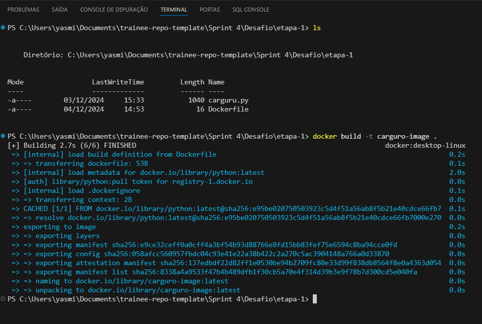
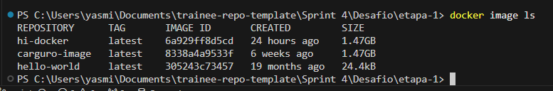
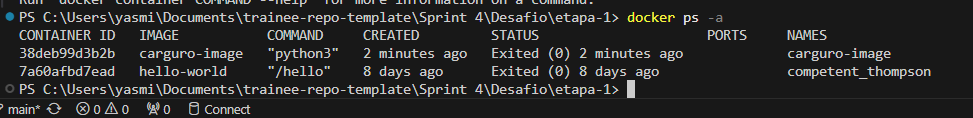
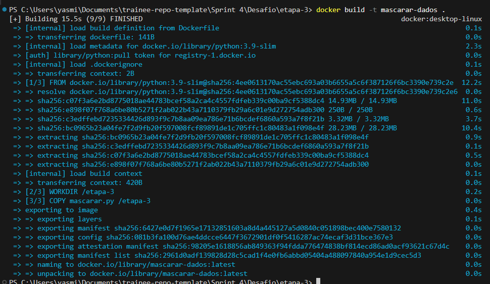
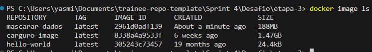
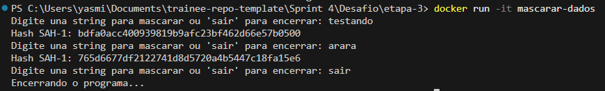
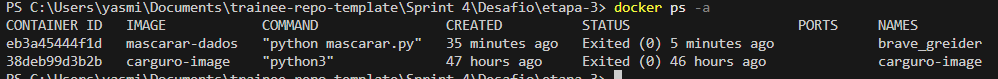

# Objetivo do desafio

Praticar python com containers docker.

**Entregáveis:**

- arquivo dockerfile
- comandos utilizados para execução de container
- respostas para os questionamentos no formato markdown
- evidências (prints) da execução bem sucedida


# Etapas

### **Preparação**:

- Instalei o Docker para windows;
- criei uma conta no dockerhub;
- preparei o Vscode baixando as extenções necessárias.


[...]

___

## 1.  Etapa I

Foi pedido para criar uma imagem docker utilizando o arquivo [carguru.py](../Desafio/etapa-1/carguru.py), que possuí um código que retorna de forma aleatória uma marca de carro da lista. Para a criação dessa imagem criei um arquivo Dockerfile: [Código da imagem](../Desafio/etapa-1/Dockerfile).

[...]

O comando FROM especifica qual a tecnologia que estará sendo usada, que nesse caso é o python 3. Utilizei a imagem oficial disponibilizada no repositório do próprio docker, porém na versão slim por ser mais leve.

```dockerfile
FROM python:3.9-slim
```


Então o comando WORKDIR que especifica qual o caminho do diretório que será realizado, que nesse caso é a etapa1 do desafio da sprint 4 mas eu usei somente o caminho relativo.

```dockerfile
WORKDIR /etapa-1
```


E então copiei o arquivo python para essa pasta de trabalho.

```dockerfile
COPY carguru.py /etapa-1
```


E por fim utilizei o comando CMD para rodar o script quando o container iniciar.

```dockerfile
CMD ["python", "carguru.py"]
```


[...]


Após isso, foi necessário contruir a imagem, para isso utilizei o próprio terminal do VS Code e rodei o comando e coloquei o mesmo nome do script python.

```shell
docker built -t carguru-image .
```


- 


Para checar a imagem, utilizei o comando: docker imge ls e ela ja estava constando na lista de imagens.
- 


E então executei o comando para criar um container a partir da imagem e mantendo o mesmo nome:

```shell
docker run --name carguru-container carguru-image
```

.

- 


___

## 2. Etapa II
 
   #### **É possível reutilizar containers?**

Se for no caso de containers que foram *parados*, sim, para reutilizá-los só seria necessário reiniciá-los utilizando o comando:

```shell
docker start <ID ou nome do container>
```

Nesse caso, só não seria possível caso o container já tenha sido removido ou a imagem não exista mais (tenha sido excluida), então seria preciso criar um novo container.


 ___

## 3. Etapa III

Foi pedido para criar um container que permita receber inputs durante sua execução.

 Para isso, foi preciso implementar um script python que receba uma string e gere uma hash da mesma por meio do algoritmo SHA-1, imprimi-la na tela e voltar para o primeiro passo.

- Código: [script python para mascar dados](../Desafio/etapa-3/mascarar.py)


Importei a biblioteca *hashlib* para ser possível gerar os códigos hash, então inicie um loop infinito com o *while true* que somente é parado quando a pessoa digitar 'sair'. Então dentro desse loop, utilizei o *input* para receber as entradas, e o comando *if* para a condição, se caso a string seja sair o loop quebra e é printado na tela o aviso de que o programa será encerrado.

```python
import hashlib

while True:
    entrada = input("Digite una string para mascarar ou 'sair' para encerrar: ")
    if entrada.lower() == 'sair':
        print("Encerrando o programa...", flush=True)
        break
```


Caso a pessoa não tenha digitado 'sair' o codigo segue para a criação da hash para a palavra inserida, sendo que o codigo "hashlib.sha1" cria um objeto que calcula o hash SHA-1 da entrada, e o "entrada.encode()" converte a string inserida em bytes, porque funções de hash trabalham com dados binários. Então o método "hash_obj.hexdigest()" converte o hash gerado em um representação hexadecima, que nada mais é do que um string legível contendo os caracteres  de 0-9 e a-f. Por fim, printei o resultado da hash criada a partir da string recebida na tela.

```python
    hash_obj = hashlib.sha1(entrada.encode())
    hash_hex = hash_obj.hexdigest()
    print (f"Hash SAH-1: {hash_hex}", flush=True)
```

Utilizei o "flush=True" nos prints para forçar que o resultado saísse imediatamente no terminal, pois tive alguns problemas no momento de teste.

Então basicamente criei um loop que recebe strings e transforma essa entrada em um código criptografado (hash), e caso a pessoa deseje parar-lo só será necessário digitar "sair".


[...]


Logo após criei o arquivo [Dockerfile](../Desafio/etapa-3/Dockerfile)  para criar a imagem da minha aplicação (o script python):


Como na etapa 1, utilizei a imagem oficial de python3 slim, e determinei o diretório onde ela seria feita, que no caso é a etapa-3.

```dockerfile
FROM python:3.9-slim

WORKDIR /etapa-3
```


Copiei o script que mascara os dados na pasta da etapa-3 e utilizei o comando CMD para rodar esse script quando o container iniciar.

```dockerfile
COPY mascarar.py /etapa-3

CMD ["python", "mascarar.py"]
```


[...]


Abri o terminal do próprio vscode para começar a criação do container. Antes, é preciso construir a imagem, então utilizei o comando:

```shell
docker build -t mascarar-dados . 
```

- 


então "mascarar-dados" já consta na lista de imagens do docker:

- 


[...]


Por fim, utilizei um comando que, a partir da imagem,  executa o container de forma interativa (onde é possivel passar entradas de dados) atrávez do parâmetro "-it" que érmite essa interatividade.

```shell
docker run -it mascarar-dados
```

testando (mascarando palavras):

- 


Utilizando o comando "docker ps -a" podemos observar que ele já consta na lista de containers:

- 