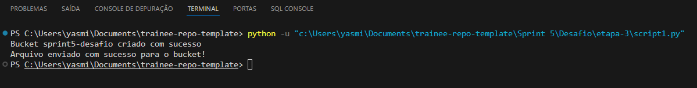
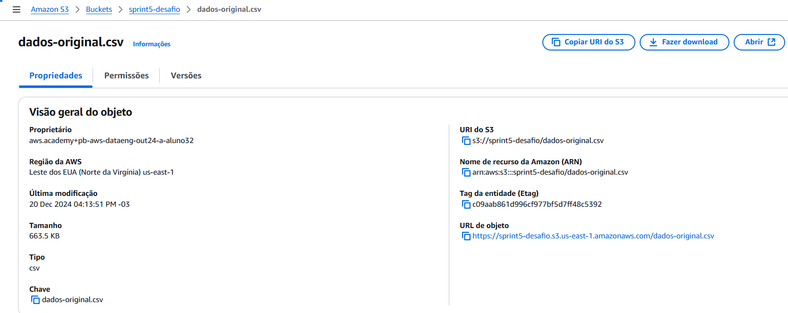
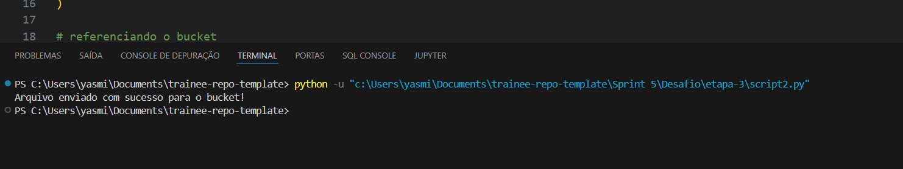
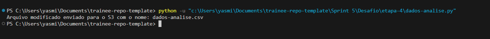
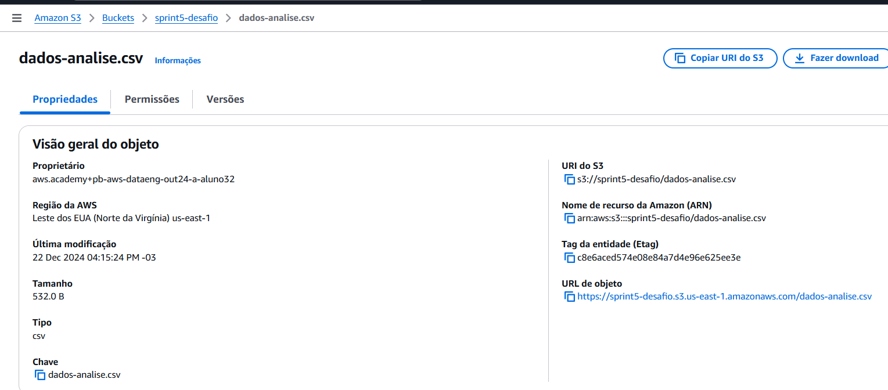

# Objetivo do desafio

Praticar os conhecimentos de nuvem AWS aprendidos na sprint, manipulando arquivos diretamente no S3.


# Etapas


## 1.  Etapa I

Procurei um arquivo CSV no portal de dados públicos no Governo Brasileiro (http://dados.gov.br), e acabei escolhendo um conjunto de dados da UFPR (Universidade Federeal do Paraná) que trás as despesas mensais por grupo de despesas, então decidi pegar a mais recente, que no caso é o de 2023.

- [arquivo csv original: UFPR - Despesas mensais (2023)](../Desafio/etapa-1/financeiro_despmensais_2023.csv)

As colunas do documento consistem em: Data, Grupo_Despesa, Elemento_Despesa, Natureza_Despesa, Favorecido_CNPJ,Favorecido e Valor. Para entender melhor a estrutura e o significado dos dados utilizei o documento disponibilizado: [financeiro_despmensais_dicionario.pdf](https://transparencia.ufpr.br/api/pdf/financeiro_despmensais_dicionario.pdf).

___

## 2. Etapa II

Me familiarizei com o conjunto de dados escolhido e comecei a pensar no que poderia ser analisado a pertir dele. E antes de começar a fazer propriamente a analise, realizei a limpeza e normalização desses dados, para isso, criei um arquivo notebook para facilitar a vizualização: [notebook da limpeza dos dados](../Desafio/etapa-2/limpeza-dados.ipynb)


Utilizei a biblioteca pandas para facilitar o processo e li o arquivo usando a variável "dados" e a função "pd.read_csv" indicando a separação dos itens por ponto e vírgula, e sinalizando que o dataframe utiliza o encoding latin-1.
Quando analisei a base de dados anteriormente, notei que varios valores da coluna "Favorecido_CNPJ" havia inconcistências no padrão de alguns cnpjs, alguns com números muito menor do que o padrão, ex: "153079" e alguns com caracteres especiais, ex: "xxxxxxxxx68". Então fiz uma função qe mantém somente os valores válidos e transforma o restante em valores: "None".

```python
import pandas as pd

dados = pd.read_csv("C:/Users/yasmi/Documents/trainee-repo-template/Sprint 5/Desafio/etapa-1/financeiro_despmensais_2023.csv", sep=";", encoding="latin1")

def validar_cnpj(cnpj):
    cnpj = str(cnpj)  
    return cnpj.isdigit() and len(cnpj) == 14  

dados["Favorecido_CNPJ"] = dados["Favorecido_CNPJ"].apply(lambda x: x if validar_cnpj(x) else None)

```


Anteriormente havia testado se havia alguma linha duplicada ou com valores nulos mas não possuia nenhum, então passei para a fase de normalizar os tipos de dados, como a coluna de data, preço e textos.

```python
dados['Data'] = pd.to_datetime(dados['Data'], format='%Y-%m-%d')
dados['Valor'] = pd.to_numeric(dados['Valor'], errors='coerce')

dados['Grupo_Despesa'] = dados['Grupo_Despesa'].str.strip().str.upper()
dados['Elemento_Despesa'] = dados['Elemento_Despesa'].str.strip().str.upper()
dados['Favorecido'] = dados['Favorecido'].str.strip().str.upper()


dados
```


Após isso, exportei o resultado para um arquivo .csv sem o índice que ele adiciona automaticamente, resultando no [dados-tratados.csv](../Desafio/etapa-2/dados-tratados.csv)
```python
dados.to_csv('dados-tratados.csv', index=False)
```

[...]

___

## 3. Etapa III

Então foi pedido para criar um script python que carregue o arquivo para um bucket novo para executar o desafio. Conversando com o monitor nas reuniões técnicas, foi informado que seria necessário enviar o arquivo original e o tratado para o bucket, então criei dois scripts para enviá-los.

código: [Script 1 - criando um bucket na AWS e carregando o arquivo original](../Desafio/etapa-3/script1.py)


Como indicado nas instruções, importei o Boto3 para os fazer os scripts. Então configurei as credenciais da conta AWS que são usadas para autenticar e autorizar a interação com a AWS, indicando a chave de acesso, a chave secreta associada a chave de acesso e o token da seção, que é temporaria e expira em algumas horas. O indicado seria não colocar as credenciais diretamente no script, mas sim criar variáveis de ambiente, porém obtive alguns problemas com isso e decidi seguir com esse plano B.

```python
import boto3

# credenciais
aws_access_key_id=''
aws_secret_access_key=''
aws_session_token=''

```


Utilizei o comando "boto.resource("s3")" que permite manipular recursos da AWS, como bucketse objetos, e o parâmetro sendo as credenciais da conta informada anteriormente. Logo após, criando o "bucket sprint5-desafio" para armazenar os arquivos do desafio.

```python
# iniciando o recurso S3
s3 = boto3.resource(
    's3',
    aws_access_key_id=aws_access_key_id,
    aws_secret_access_key=aws_secret_access_key,
    aws_session_token=aws_session_token
)

# criando o bucket
bucket_name = 'sprint5-desafio'
bucket = s3.create_bucket(Bucket=bucket_name)
print(f"Bucket {bucket_name} criado com sucesso")
```


Depois da criação do bucket já era possível realizar o upload do arquivo, para isso, informei o caminho do arquivo e o nome que gostaria de aplicar ao arquivo. Criei um bloco com o comando "bucket.upload_file(arquivo_path, arquivo_key)" que realiza o upload do arquivo e informa se ele foi feito com sucesso ou se houve algum erro.
```python
# upload do arquivo
arquivo_path = 'Sprint 5/Desafio/etapa-1/financeiro_despmensais_2023.csv'
arquivo_key = 'dados-original.csv'

try:
    bucket.upload_file(arquivo_path, arquivo_key)
    print("Arquivo enviado com sucesso para o bucket!")
except Exception as e:
    print("Erro ao fazer upload do arquivo.")
```


- execução do script: 

    

- bucket e arquivo já constam na AWS:
    
    


[...]


código: [Script 2 - realizando o upload dos dados trtados para o bucket já criado](../Desafio/etapa-3/script1.py)


Seguindo o mesmo padrão do primeiro script, apresentando as credencias e o recurso que será utilizado.
```python
import boto3

# credenciais
aws_access_key_id=''
aws_secret_access_key=''
aws_session_token=''

# iniciando o recurso S3
s3 = boto3.resource(
    's3',
    aws_access_key_id=aws_access_key_id,
    aws_secret_access_key=aws_secret_access_key,
    aws_session_token=aws_session_token
)

```


Como o bucket já foi criado, só é preciso referenciá-lo e informar o caminho do arquivo e o nome que gostaria de nomear o arquivo no bucket. Então reutilizando o mesmo bloco de upload de arquivo do script anterior.
```python
# referenciando o bucket
bucket_nome = 'sprint5-desafio'
bucket = s3.Bucket(bucket_nome)

# upload do arquivo
arquivo_path = 'C:/Users/yasmi/Documents/trainee-repo-template/Sprint 5/Desafio/etapa-2/dados-tratados.csv'
arquivo_key = 'dados-tratados.csv'

try:
    bucket.upload_file(arquivo_path, arquivo_key)
    print("Arquivo enviado com sucesso para o bucket!")
except Exception as e:
    print("Erro ao fazer upload do arquivo.")
```


- execução do script:
    


- o arquivo já consta no bucket:
    


[...]


___

## 4. Etapa IV

Foi pedido para criar outro script a partir do arquivo que está dentro do S3, criar um dataframe e executar as seguintes manipulações: 
    
**1.** uma clausula que filtra dados usando ao menos dois operadores lógicos;

**2.** duas funções de agregação; 

**3.** uma função condicional; 

**4.** uma função de conversão; 

**5.** uma função de data; 

**6.** uma função de string.

[...]

A partir dos requisitos pedidos e da base de dados que escolhi, decidi criar uma pergunta especifica para responde-la na análise: 

 **"Qual foi o maior grupo de despesa no mês de agosto, considerando apenas despesas acima de R$2000 e cujo favorecido seja "UNIVERSIDADE FEDERAL DO PARANA", constando suas subcategorias, seus gastos totais e a média geral desses gastos?"**

código: [Script - Análise dos dados](../Desafio/etapa-4/dados-analise.py)


Seguindo o mesmo padrão dos outros scripts, adicionei as credenciais de acesso e iniciei o cliente s3.

```python
import boto3
import pandas as pd

aws_access_key_id=''
aws_secret_access_key=''
aws_session_token=''

s3_client = boto3.client(
    's3',
    aws_access_key_id=aws_access_key_id,
    aws_secret_access_key=aws_secret_access_key,
    aws_session_token=aws_session_token
)
```


Referenciei o bucket, nome do arquivo e utilizei o comando ".get_object" para fazer o download do arquivo armazenado no bucket, e depois "pd.read_csv(response['Body'])" que contém o conteudo do arquivo, para ler ele.

```python
bucket_name = 'sprint5-desafio'
arquivo_key = 'dados-tratados.csv' 

# Carregando o arquivo do S3
response = s3_client.get_object(Bucket=bucket_name, Key=arquivo_key)
dados = pd.read_csv(response['Body'])  
```


### Analise dos dados usando pandas


Convertendo a coluna "Data" para datetime e criei uma coluna separada para os meses de cada registro que será utilizada na análise final. Criei um filtro para os registros do mês de agosto (8), registros com valores acima de dois mil reais e por fim retornar somente os registros que a coluna "Favorecido" consta como "UNIVERSIDADE FERDERAL DO PARANA"(e removendo espaços extras com ".str.strip()").

```python
dados['Data'] = pd.to_datetime(dados['Data'], format='%Y-%m-%d')
dados['Mes'] = dados['Data'].dt.month

filtro = (
    (dados['Mes'] == 8) & 
    (dados['Valor'] > 2000) & 
    (dados['Favorecido'].str.strip() == "UNIVERSIDADE FEDERAL DO PARANA")
)
dados_filtrados = dados[filtro].copy()
```


Adicionando uma coluna condicional chamada Valor_Alta, onde valores acima de R$5000 é considerado alto e abaixo desse valor considerado como baixo. E então agrupando os dados pelo "Grupo_Despesa" e "Elemento_Despesa" e calcula a soma e a média desses valores.

```python
dados_filtrados.loc[:, 'Valor_Alta'] = dados_filtrados['Valor'].apply(lambda x: 'Alta' if x > 5000 else 'Baixa')

# agrupamento e agregação
resultado = (dados_filtrados).groupby(['Grupo_Despesa', 'Elemento_Despesa'], as_index=False).agg(Total_Gasto=('Valor', 'sum'), Media_Gasto=('Valor', 'mean'))
```


Extraindo informações do grupo com maior gasto tota, concatenando as subcategorias "Elemento_desapesa", utilizando a função ".join", e seus gastos no mesmo campo. E por fim, criando um dataframe juntando esses dados que já foram filtrados para retornar na resposta da pergunta.

```python
# resultado consolidado em um dataframe
grupo_nome = grupo_maior_gasto['Grupo_Despesa']
gasto_total = grupo_maior_gasto['Gasto_Total']
media_geral = grupo_maior_gasto['Media_Final']
subcategorias = ", ".join(
    f"{row['Elemento_Despesa']} (R${row['Total_Gasto']:.2f})"
    for _, row in resultado[resultado['Grupo_Despesa'] == grupo_nome].iterrows()
)

resultado_df = pd.DataFrame({
    'Maior Grupo de Despesa': [grupo_nome],
    'Gasto Total': [gasto_total],
    'Média Geral': [media_geral],
    'Subcategorias': [subcategorias]
})
```


Já adiantando a etapa 5, converti o dataframe em csv e fiz o upload do arquivo para o s3 com o nome "dados-analise.csv"

```python

csv_output = resultado_df.to_csv(index=False)

output_key = 'dados-analise.csv'

# enviando o arquivo modificado de volta para o S3
s3_client.put_object(Bucket=bucket_name, Key=output_key, Body=csv_output)

print(f"Arquivo modificado enviado para o S3 com o nome: {output_key}")
```


- execução do script:
    

- o arquivo constando no bucket:
    


[...]

___

## 5. Etapa V

Pedia para salvar o arquivo no formato CSV e enviar-lo para o mesmo bucket criado para esse desafio, porém como dito anteriormente, adicionei essa parte no próprio script. Então fui até o bucket e baixei o arquivo dos dados da análise que já constava lá após a execução do script anterior.

- [dados-analise.csv](../Desafio/etapa-5/dados-analise.csv)


[...]


Pergunta: *"Qual foi o maior grupo de despesa no mês de agosto, considerando apenas despesas acima de R$2000 e cujo favorecido seja "UNIVERSIDADE FEDERAL DO PARANA", constando suas subcategorias, seus gastos totais e a média geral desses gastos?"*

Resposta: 


