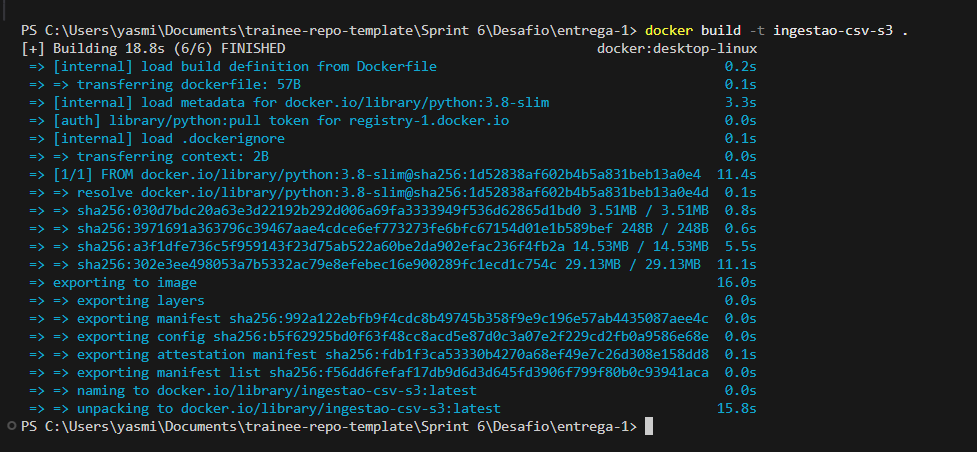
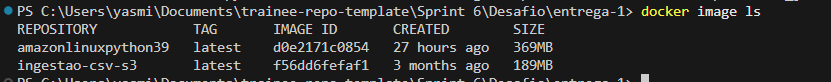
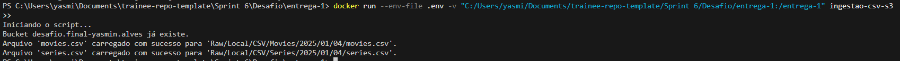
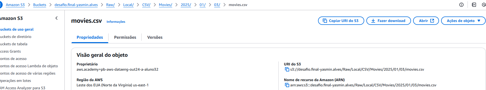

# Desafio Final

**Objetivo**: construção de um datalake para um case de *filmes e series* , com as etapas de: ingestão, armazenamento, processamento e consumo.

Cada squad recebeu duas categorias de filmes/series para, a partir dos dados oferecidos, realizar uma análise aprofundada, respondendo perguntas que nós desenvolvemos com esses dados. Esse desafio será seccionado em 5 etapas, sendo a sprint 6 o começo delas.


- Minhas categorias: **Comédia & Animação**

Para conduzir minha análise, decidi focar no período da década de 1990. A partir dos dados, meu objetivo é explorar os atores e atrizes mais recorrentes nos filmes de comédia e animação, avaliando sua relevância com base no desempenho crítico (nota média dos filmes).
O foco principal da análise será a questão da representatividade feminina nesses gêneros, investigando a recorrência de atrizes nos filmes mais bem avaliados e comparando como essa representatividade varia entre comédia e animação.

### Perguntas desenvolvidas para a análise:

- Qual o top 20 atores/atrizes mais recorrentes em filmes de animação nos anos 90 que tiveram o melhor desempenho na crítica, considerando a nota média desses filmes?

- Qual o top 20 atores/atrizes mais recorrentes em filmes de comédia nos anos 90 que tiveram o melhor desempenho na crítica, considerando a nota média desses filmes?

- Qual a proporção de artistas femininas e masculinos entre os Top 20 atores/atrizes mais recorrentes em filmes de animação e comédia dos anos 90? Existe uma diferença significativa na representatividade feminina entre esses dois gêneros?


[...]


# Objetivo da Entrega 1

Praticar a combinação de conhecimentos vistos no programa, fazer um mix de tudo que já foi dito.

**Ingestão Batch**: ingestão dos arquivos CSV em bucket amazon S3 RAW zone.

- Deve ser constrído um código python que será executado dentro de um container docker para carregar os dados locais dos arquivos disponibilizados para a nuvem.

- Utilizando o boto3 como parte do processo de ingestão via batch para geração de arquivo (CSV).

**Entregáveis**:

- código, comentários, evidência e documentação;
- Dockerfile
- Arquivo com o código .py


[...]


# Etapas


- [Preparação](#preparação)
- [Etapa 1 - Implementando um código python](#1--etapa-i)
- [Etapa 2 - Criando container e armazenando arquivo](#2-etapa-ii)
- [Etapa 3 - Exetando o container localmente](#3-etapa-iii)


___
### **Preparação**:

- Antes de começar ceritifique-se que possuí o entendimento completo do desafio de filmes e series;

    - [Desafio: Filmes e Series](#desafio-final)

- Fazer download do arquivo necessário para a ingestão de dados Filmes e Series.zip;

[...]

___

## 1.  Etapa I


Criação de um script python que:
1. lê os dois arquivos (filmes e series) no formato csv inteiros, ou seja, sem filtrar os dados
2. utiliza o boto3 para carregar os dados para a AWS
3. acessar a AWS e grava no S3 no bucket definido com RAW Zone
    - no momento de gravação dos dados deve-se considerar o padrão: 
    
    *nome do bucket /camada de armazenamento/origem do dado/formato do dado/especificação do dado/data de processamento separada por ano/mes/dia/arquivo*


Código: [Script.py](../Desafio/entrega-1/script.py)


Importei as bibliotecas necessárias para o funcionamento do script, adicionei uma mensagem de log no inicio para sinalizar que o script estava rodando por conta de alguns problemas que tive na execução do container.
Então adicionei as variáveis de ambiente da AWS, algo que tive dificuldade na sprint passada, porém consegui arruma-lo, evitando a inserção das credenciais diretamente no script. Para isso, criei um arquivo config e credentials na minha pasta local ".aws" com as informações da minha conta AWS. Logo após iniciei o cliente s3 para poder realizar a criaçaõ do bucket e o envio dos arquivos para minha conta.

```python
import boto3
import os
from datetime import datetime

print("Iniciando o script...")

# variáveis de ambiente
AWS_ACCESS_KEY_ID = os.getenv("AWS_ACCESS_KEY_ID")
AWS_SECRET_ACCESS_KEY = os.getenv("AWS_SECRET_ACCESS_KEY")
AWS_SESSION_TOKEN = os.getenv("AWS_SESSION_TOKEN")

# iniciando cliente do S3
s3_client = boto3.client(
    "s3",
    aws_access_key_id=AWS_ACCESS_KEY_ID,
    aws_secret_access_key=AWS_SECRET_ACCESS_KEY,
    aws_session_token=AWS_SESSION_TOKEN
)
```


Adicionei um bloco que cria um bucket chamado "desafio.final-yasmin.alves" caso ele não exista, onde será carregado os arquivos csv e restante das entregas do desafio final.

```python
# criando o bucket
bucket_name = 'desafio.final-yasmin.alves'
try:
    s3_client.head_bucket(Bucket=bucket_name)
    print(f"Bucket {bucket_name} já existe.")
except:
    s3_client.create_bucket(Bucket=bucket_name)
    print(f"Bucket {bucket_name} criado com sucesso.")
```


Após isso, informei o caminho relativo dos arquivos csv em formato de dicionário ("nome do arquivo" : "caminho do arquivo"). Criei uma variável data que usa um comando datetime para conseguir acessar a data atual do sistema no formato AAAA/MM/DD.

```python
# local dos arquivos
arquivos = {
    "movies.csv": "/entrega-1/dados/movies.csv",
    "series.csv": "/entrega-1/dados/series.csv"
}

# data de processamento
data = datetime.now().strftime("%Y/%m/%d")
```


Então criei um loop que busca os itens do dicionário 'arquivos', que possuí o caminho dos arquivos, então criei a variável "tipo_dado" que extrai a informação do tipo do arquivo utilizando o comando ".split(.)[0]" que pega o nome do arquivo sem a extenção dele, retornando "Movies" ou "Series". A variável "caminho_s3" que cria o caminho para os arquivo no s3 como pedido no desafio utilizando as variáveis cridas do tipo, data e o nome do arquivo.
Logo após, utilizei o try para realizar o upload dos arquivos no caminho informado, e retornar se ele foi enviado corretamente ou se ocorreu algum erro.

```python
# upload dos arquivos CSV para o S3
for nome_arquivo, caminho_local in arquivos.items():
    tipo_dado = nome_arquivo.split(".")[0].capitalize()  
    caminho_s3 = f"Raw/Local/CSV/{tipo_dado}/{data}/{nome_arquivo}"

    try:
        s3_client.upload_file(caminho_local, bucket_name, caminho_s3)
        print(f"Arquivo '{nome_arquivo}' carregado com sucesso para '{caminho_s3}'.")
    except Exception as e:
        print(f"Erro ao carregar '{nome_arquivo}': {e}")
```


[...]

___

## 2. Etapa II

criar container docker com um volume para armazenar os arquivos CSV e executar processo python implementado

Código: [Dockerfile](../Desafio/entrega-1/Dockerfile)


Utiliza uma imagem leve do Python 3.9 como base, configurei o diretório de trabalho como "/entrega-1" onde se encontra o script python, copiei todos os arquivos do projeto para o container, instalei os pacotes necessários (que no caso é somente o Boto3) para a execução do script no container especificadas no documento [requirements.txt](../Desafio/entrega-1/requirements.txt), e por fim defini o script "script.py" como o comando principal a ser executado quando o container iniciar.

```docker
FROM python:3.9-slim

WORKDIR /entrega-1

COPY . /entrega-1/

RUN pip install --no-cache-dir -r requirements.txt

CMD ["python", "script.py"]
```

Construindo imagem: "ingestão-csv-s3"




Imagem criada: "ingestão-csv-s3"




[...]

___

## 3. Etapa III

executar localmente o container docker para realizar a carga dos dados ao S3.

Para executar o container, criei um arquivo .env com as minhas credenciais da AWS assim



Resultado no console da AWS:

