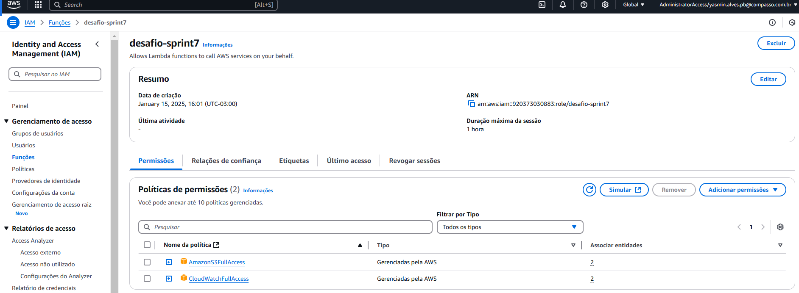
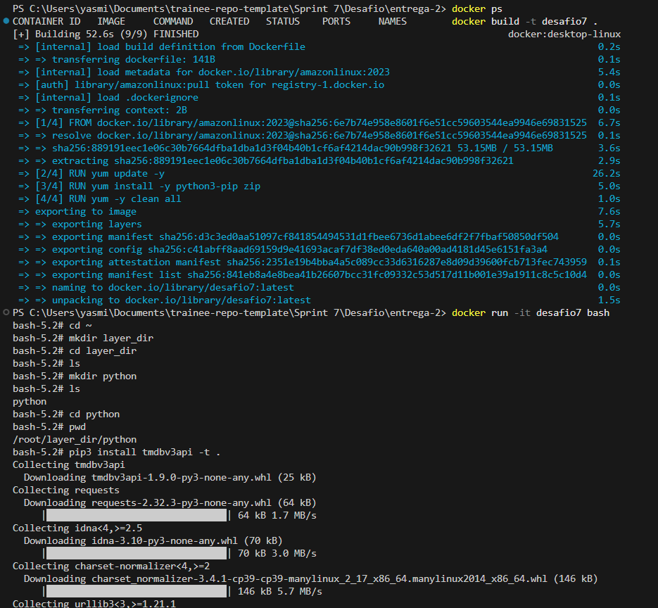
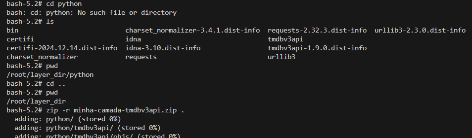
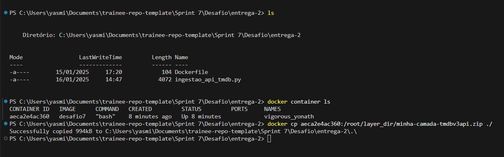
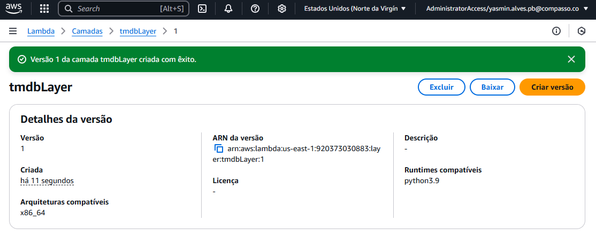
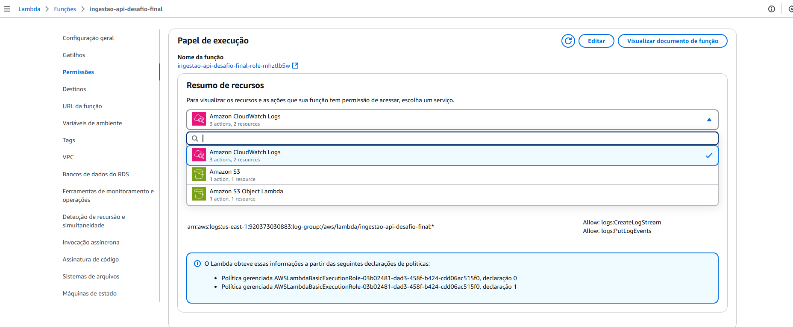
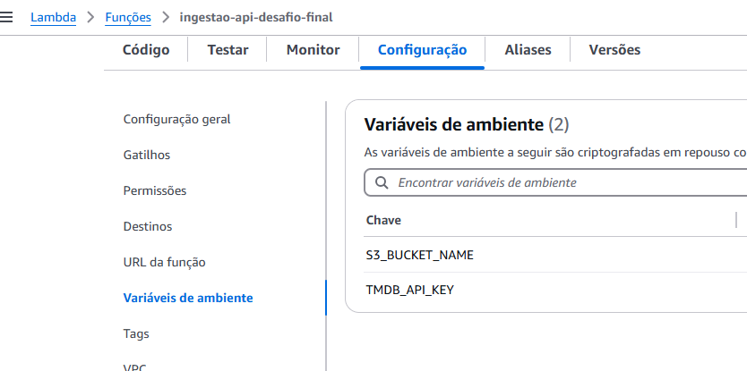
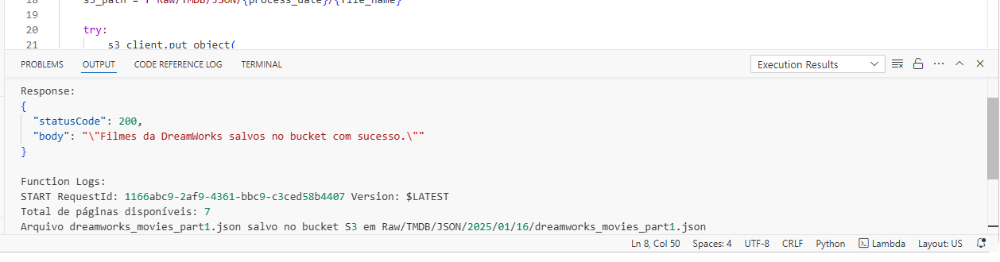
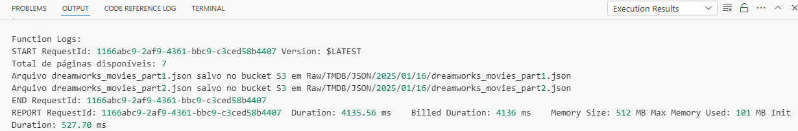
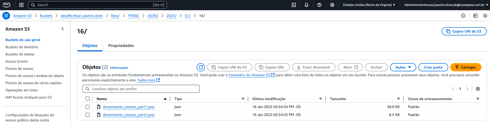

# Desafio Final

Realizando o exercício de TMDB eu tive uma ideia e decidi trocar a minha análise das perguntas desenvolvidas na sprint passsada. Sou uma grande fã de animações, então decidi pegar os filmes da dreamworks animation, conhecida por filmes iconicos como shrek, kung fu panda, como treinar seu dragão, entre outros, e decidi focar minha análise nas produções da companhia, mantendo também dentro do tema da minha squad (animação e comédia).

### Novas Perguntas:

- *Quais são os filmes de maior bilheteria da DreamWorks?*

- *Como a bilheteria média de histórias originais se compara com a de continuações?*

- *Qual é o impacto de continuações no declínio ou crescimento das avaliações de uma franquia?*

- *Qual é a média de avaliações de histórias originais em comparação com continuações e adaptações?*


Meu principal objetivo com essa análise é investigar como as continuações de filmes pode afetar na percepção do público e no desempenho economico das produções, e se vale a pena continuar realizando continuações.

[...]


# Objetivo da entrega 2 

Complementar os dados dos arquivos csv Filmes e series, carregados na etapa1, com dados oriundos do TMDB.

    Os dados coletados devem ser persistidos em Amazon S3, camada RAW Zone, mantendo o formato de origem (JSON) e, se possível, agrupando-os em arquivos com, no máximo, 100 registros cada arquivo.

[...]


# Etapas

1. [Preparação](#preparação)

2. [Script Python - consumindo a API](#script-python)

3. [Crindo a layer com a biblioteca](#criando-layer)

4. [Configurando o lambda](#configurando-o-lambda)

5. [Rodando o script no lamda e resultados](#executando-script-e-resultados)


[...]

## **Preparação**:

- Procurei informações sobre a API do TMDB na documentação do próprio site -> [Getting started - API TMDB](https://developer.themoviedb.org/docs/getting-started)

- Procurei informações da bibioteca sugerida nas instruções do desafio -> [informações sobre "tmdbv3api" no github](https://github.com/AnthonyBloomer/tmdbv3api)

- Registrei uma conta no TMDB para conseguir minha chave da API

- Criei uma função no IAM para dar acesso a minha lambda executar ações na S3:

    


[...]

## **Script Python**

- código: [Script - ingestao_api_tmdb.py](../Desafio/entrega-2/ingestao_api_tmdb.py)


Primeiramente importei as bibliotecas necessária para executar o script. 
*json* para manipular os dados no formato pedido;
*boto3* para interagir com os serviços da AWS, especificamente o S3;
*tmdbv3api* para interagir com a API do TMDB e fazer as rquisições necessárias, importando somente as classes necessárias;
*datetime* para manipular datas e gravar a data de processamento da forma que foi pedido nas orintações;
*os* para acessar as variáveis de ambiente.


```python
import json
import boto3
from tmdbv3api import TMDb, Discover, Movie
from datetime import datetime
import os
```


Configurando a chave da API através de uma variável de ambiente, definindo o idioma para trazer as respostas em inglês (como os dados do arquivo csv são em inglês decidi manter o padrão); acionei as classes que serão usados para descubrir os detalhes dos filmes e buscar pro critérios específicos.

```python
tmdb = TMDb()
tmdb.api_key = os.environ.get("TMDB_API_KEY")  # variável de ambiente
tmdb.language = "en"
discover = Discover()
movie = Movie()
```


iniciando o s3 client para interagir com o meu bucket. Utilizei a função "save_to_s3" para salvar os arquivos json gerados no meu bucket do desafio final, utilizando o datetime.now para conseguir a data que o processamento será realizado e ".strftime("%Y/%m/%d")" para separar a data em ano, mês e dia como pedido nas orintações. O nome dos arquivos json como "fil_name" e o caminho das pastas no meu bucket como "s3_path".

E então utilizei um parÂmetro try/execept para tentar colocar os arquivos no meu bucket e informar caso haja algum erro.

```python
s3_client = boto3.client("s3")

def save_to_s3(data, bucket_name, batch_count):
    process_date = datetime.now().strftime("%Y/%m/%d")
    file_name = f"dreamworks_movies_part{batch_count}.json"
    s3_path = f"Raw/TMDB/JSON/{process_date}/{file_name}"

    try:
        s3_client.put_object(
            Bucket=bucket_name,
            Key=s3_path,
            Body=json.dumps(data, ensure_ascii=False, indent=4),
            ContentType="application/json"
        )
        print(f"Arquivo {file_name} salvo no bucket S3 em {s3_path}")
    except Exception as e:
        print(f"Erro ao salvar no S3: {e}")
        raise
```


Definindo a função "fetch_dreamworks_movies" ('fetch'-> busca/recuperação de dados) para buscar somente filmes da dreamworks animation, informando o id que corresponde a agência no tmdb, e processar seus detalhes em lotes de 100 registros no meu bucket. 
Passando as variáveis id, page (pagina atual de busca na API), total_fetched (total de filmes preocessados), batch_count (contador dos lotes gerados), movie_details (lista para guardar os detalhes dos filmes processados).

```python
def fetch_dreamworks_movies(bucket_name, batch_size=100):
    company_id = 521  # ID da DreamWorks
    page = 1
    total_fetched = 0
    batch_count = 1
    movie_details = []
```


Iniciando a busca para saber quantas paginas de resultados o mtmdb possui para os filmes da dreamwoks, ou exibir o erro caso algo inesperado aconteça.

```python
    try:
        first_response = discover.discover_movies({
            "with_companies": company_id,
            "page": 1
        })

        if not hasattr(first_response, "total_pages"):
            print("Erro ao obter o número total de páginas.")
            return

        total_pages = first_response.total_pages
        print(f"Total de páginas disponíveis: {total_pages}")
    except Exception as e:
        print(f"Erro ao inicializar a busca de filmes: {e}")
        raise
```


Processamento da requisição pagina

```python
while page <= total_pages:
        try:
            response = discover.discover_movies({
                "with_companies": company_id,
                "page": page
            })

            if not response or not hasattr(response, "results"):
                print(f"Sem mais resultados ou erro na página {page}. Encerrando.")
                break

            for m in response.results:
                if not hasattr(m, "id"):
                    print(f"Item inválido na página {page}: {m}")
                    continue

                details = movie.details(m.id)
                movie_data = {
                    "imdb_id": details.imdb_id,
                    "title": details.title,
                    "revenue": details.revenue,
                    "budget": details.budget,
                    "production_countries": [country["name"] for country in details.production_countries],
                    "spoken_languages": [lang["name"] for lang in details.spoken_languages],
                    "status": details.status,
                    "is_sequel": bool(details.belongs_to_collection),
                    "collection_name": details.belongs_to_collection["name"] if details.belongs_to_collection else None
                }

                movie_details.append(movie_data)
                total_fetched += 1

                if total_fetched % batch_size == 0:
                    save_to_s3(movie_details, bucket_name, batch_count)
                    movie_details = []
                    batch_count += 1
            page += 1
        except Exception as e:
            print(f"Erro ao processar a página {page}: {e}")
            break

```


```python
    if movie_details:
        save_to_s3(movie_details, bucket_name, batch_count)
```


```python
def lambda_handler(event, context):
    try:
        bucket_name = os.environ.get("S3_BUCKET_NAME")
        if not bucket_name:
            raise ValueError("Erro  nas variáveis de ambiente.")

        fetch_dreamworks_movies(bucket_name, batch_size=100)
        return {
            "statusCode": 200,
            "body": json.dumps("Filmes da DreamWorks salvos no bucket com sucesso.")
        }
    except Exception as e:
        print(f"Erro na execução do Lambda: {e}")
        return {
            "statusCode": 500,
            "body": json.dumps(f"Erro: {str(e)}")
        }
```


[...]


            Inicialmente o script era bem menos complexo e mais direto ao ponto, porém tive que acrescentar algumas mudanças, principalmente sobre a questão de paginação, porque ele só estava retornando um lote de 100 filmes porque não estava conseguindo acessar as outras paginas de resultados para dreamworks, então aparecia erros informando sobre isso. A partir disso fiz uma pesquisa sobre como funciona essa questão de paginas e realizei as mudanças necessárias para ele acessar todas elas sem problemas.

[...]


## **Criando Layer**

Para rodar o script no AWS Lambda é necessário criar uma camada (layer) com as bibliotecas que não são nativas na aws, como o tmdbv3api. Para criar a camada com a biblioteca, eu segui o passo a passo do exercício de lamda da sprint passada.

Então usei o cód do um arquivo [Dockerfile](../Desafio/entrega-2/Dockerfile) do exercicio que configura uma imagem baseada no amazon linux 2023 e que instala o python 3.

```dockerfile
FROM amazonlinux:2023
RUN yum update -y
RUN yum install -y \
python3-pip \
zip
RUN yum -y clean all
```

[...]

Construi a imagem com o nome desafio7 e executei ele interativamente, abrindo o powershell e criando as pastas como pedido nas orientações e então instalando a biblioteca do tmdbv3api na pasta python.




Logo após, zipei a pasta python como "minha-camada-tmdbv3api.zip" com os arquivos da biblioteca dentro dela




Em outro terminal, usei o id do container para copiar o arquivo zip dentro dele na minha maquina local




Após isso, no console da aws, na aba de camadas do lambda, criei uma layer com o nome tmdbLayer e realizei o upload do arquivo zip e criei ela para usar na minha função




[...]

## **Configurando o Lambda**

Como no script realiza o upload dos arquivos json no bucket do desafio, adicionei a permissão crianda anteriormente no IAM com full access ao s3




Adicionei os valores das variáveis de ambiente nas configurções da função




[...]


## **Executando script e Resultados**


Após cofigurar a função, relaizei o deploy do script e criei um teste para rodar o código, obtendo o segundo resultado:




Nos logs da função ele informa que o resultado da pesquisa dos filmes da dreamwors tem um total de 7 páginas. A partir disso ele criou os arquivos json e salvou eles no caminho pedido (Raw/TMDB/JSON/<data de proceassamento dividido por ano/mês/dia>/arquivo.json), obtendo um total de 2 arquivos json 




Ao final, dentro do bucket a estrutura das pastas se encontra assim:




[...]
 

**Arquivos JSON:**

- [dreamworks_movies_part1.json](../Desafio/entrega-2/dreamworks_movies_part1.json)

- [dreamworks_movies_part2.json](../Desafio/entrega-2/dreamworks_movies_part2.json)

    


