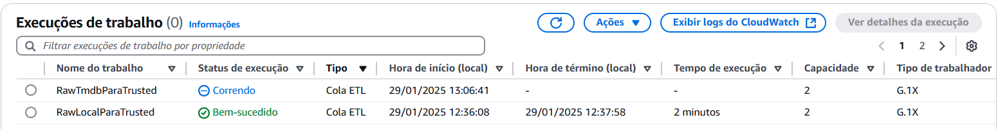
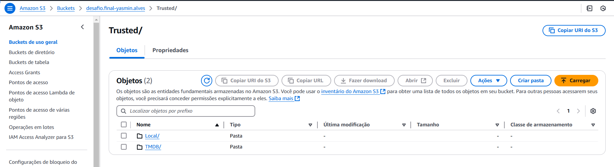

# Desafio Final

Como informado na sprint anterior, minha análise é direcionada aos filmes da Dreamworks Animation. Uma análise focada em como continuações impactam na opnião do público geral e se vale a pena continuar investindo em coleções ao invés de filmes originais. 

Perguntas:

- *Quais são os filmes de maior bilheteria da DreamWorks?*

- *Como a bilheteria média de histórias originais se compara com a de continuações?*

- *Qual é o impacto de continuações no declínio ou crescimento das avaliações de uma franquia?*

- *Qual é a média de avaliações de histórias originais em comparação com continuações e adaptações?*

Para responder essas perguntas, ingeri somente dados da API do TMDB para complementar o arquivo CSV disponibilizado.

[...]


# Objetivo da Entrega 03

Nessa entrega foi pedido para gerar uma visão padronizada dos dados, do S3, disponível em um database do *Glue Data Catalog* e acessível via *AWS Athena* compreendendo a Trusted Zone do data lake.

**Entregáveis:**

1. Codigo desenvolvido com os devidos comentários:

     1.1.  Arquivo contendo o código Python no formato .PY representando o código AWS Glue para CSV

     1.2. Arquivo contendo o código Python no formato .PY representando o código AWS Glue para JSON

2. Markdown com a explicação das etapas executadas e evidências


[...]

# Etapas

1. [Processamento da Camada Trusted](#processamento-da-camada-trusted)

    1.1. [Preparação](#preparação)

2. [Processando o Arquivo local (CSV)](#processando-o-arquivo-local-csv)

    2.1. [Execução do Job](#execução-do-job)

    2.1.1. [Estrutura das pastas](#criação-das-pastas)

    2.2. [Criação do Crawler](#criação-do-crawler)

    2.3. [Resultado Athena](#acessando-via-athena)

3. [Processamento o arquivo do TMDB (JSON)](#processando-o-arquivo-do-tmdb-json)

    3.1. [Execução do Job](#execução-do-job-1)

    3.1.1. [Estrutura das pastas](#criação-das-pastas-1)

    3.2. [Criação do Crawler](#criação-do-crawler-1)

    3.3. [Resultado Athena](#acessando-via-athena-1)


[...]


# Processamento da Camada **Trusted**

Essa camada é equivalente a camada SILVER de um data lake bem estruturado, onde os dados coletados na camada Raw são processados, limpos e normalizados para oferecem uma maior facilidade para o consumo futuro.

Para essa sprint, foi pedido para transformar os arquivos JSON e CSV para o tipo PARQUET pois é um formato que não consome tantos recursos no momento de realizar as consultas no Athena. Para isso, desenvolvi dois scripts python pelo AWS Glue para limpar e transformar esses dados como pedido nas orientações do desafio.


[...]


## Preparação

- Criando uma função no I AM para executar os jobs no AWS Gue:

    


- Criando um database no AWS Lake Formation:

    


[...]


# Processando o Arquivo local (CSV)

- Código: [Script do Job no Glue](../Desafio/entrega-3/RawLocalParaTrusted.py)


Utilizei a mesma estrutura padrão do job glue, somente adicionei os parametro de RAW_PATH com o caminho do arquivo csv, e a TRUSTED_PATH com o caminho onde os arquivos PARQUET serão salvos na camada trusted como pedido nas orientações

> **TRUSTED_PATH**: *s3://bucket/Trusted/Local/Parquet/movies/*

```python 
import sys
from awsglue.transforms import *
from awsglue.utils import getResolvedOptions
from pyspark.context import SparkContext
from awsglue.context import GlueContext
from awsglue.job import Job

# parâmetros
args = getResolvedOptions(sys.argv, ['JOB_NAME', 'RAW_PATH', 'TRUSTED_PATH'])

sc = SparkContext()
glueContext = GlueContext(sc)
spark = glueContext.spark_session
job = Job(glueContext)
job.init(args['JOB_NAME'], args)
```


Adicionei os caminhos como variáveis dentro do código como input e output. Iniciei a leitura do arquivo csv como um dataframe, informando que ele possuí uma header, os dados são separados por "|", e utilizando o comando "inferSchema=True" para reconhecer automaticamente o tipo de dado de cada coluna e o modo permissive para converter valores que não seguem o padrão em null.

```python 
input_path = args['RAW_PATH']     
output_path = args['TRUSTED_PATH']   

# lendo o arquivo
df = spark.read.csv(input_path, header=True, inferSchema=True, sep='|', mode="PERMISSIVE")
```


Adicionando uma linha que faz a contegem das linhas do dataframe e adicionando um print como log. E por fim uma lógica condicional que se o arquivo não estiver vazio (linhas = 0) ele irá eliminar linnhas duplicadas e escrever o arquivo parquet com esses dados no caminho de saída.

```python 

num_linhas = df.count()
print(f"Número de linhas carregadas: {num_linhas}")

if num_linhas > 0:
    df.dropDuplicates().write.mode("overwrite").parquet(output_path)
    print(f"Arquivo salvo em: {output_path}")
else:
    print("Nenhum dado encontrado! O Parquet não foi gerado.")
    

job.commit()
```


[...]

## Execução do Job

Antes de executá-lo, realizei a configuração pedida e adicionei os caminhos necessários nos parâmetros do Job.


E então salvei as alterações e executei o script e fui acompanhando o processamento na aba de "job run monitoring":




### Estrutura das pastas:





Arquivos **PARQUET**:

- [dados Local - filmes 01](../Desafio/entrega-3/arquivos-praquet/dadosLocal-01.parquet)

- [dados Local - filmes 02](../Desafio/entrega-3/arquivos-praquet/dadosLocal-01.parquet)

- [dados Local - filmes 03](../Desafio/entrega-3/arquivos-praquet/dadosLocal-01.parquet)

- [dados Local - filmes 04](../Desafio/entrega-3/arquivos-praquet/dadosLocal-01.parquet)


[...]


## Criação do Crawler


## Acessando via Athena


[...]


## Processando o Arquivo do TMDB (JSON)

- Código: [Script do Job ](../Desafio/entrega-3/RawTmdbParaTrusted.py)


Utilizando a estrutura padrão novamente, mas acrescentando as classes dos tipos de dados da biblioteca do *pyspark.sql.types*. Adicionando os caminhos nos parâmetros do job. 

>**TRUSTED_PATH**: *s3://bucket/Trusted/TMDB/Parquet/movies/Ano/Mes/Dia/*

** a data sendo correspondente a da ingestão dos dados do TMDB na camada Raw.

```python
import sys
from awsglue.transforms import *
from awsglue.utils import getResolvedOptions
from pyspark.context import SparkContext
from awsglue.context import GlueContext
from awsglue.job import Job
from pyspark.sql.types import StructType, StructField, StringType, FloatType, BooleanType, ArrayType

#parâmetros
args = getResolvedOptions(sys.argv, ['JOB_NAME', 'RAW_PATH', 'TRUSTED_PATH'])

sc = SparkContext()
glueContext = GlueContext(sc)
spark = glueContext.spark_session
job = Job(glueContext)
job.init(args['JOB_NAME'], args)
```


Adicionei as variáveis de input e output como os caminhos passados por parâmetro. Criei um schema definindo os tipos de dados de cada coluna dos meus arquivos json, utilizando a biblioteca do pyspark.sql.types.

```python
input_path = args['RAW_PATH']
output_path = args['TRUSTED_PATH']

schema = StructType([
    StructField("imdb_id", StringType(), True),
    StructField("title", StringType(), True),
    StructField("revenue", FloatType(), True),
    StructField("budget", FloatType(), True),
    StructField("production_countries", ArrayType(StringType()), True),
    StructField("spoken_languages", ArrayType(StringType()), True),
    StructField("status", StringType(), True),
    StructField("is_sequel", BooleanType(), True), 
    StructField("collection_name", StringType(), True)
])
```


E então iniciei a leitura dos meus arquivos utilizando o input_path como o caminho, e o schema para garantir que os dados sejam lidos com os tipos corretos, adicionando
a *.option("multiline", "true")* para indicar que o json contém várias linhas para um registro (como o spark não interpreta isso automaticamente, tive que inserir essa opção para evitar problemas).

```python
tmdb_df = spark.read.schema(schema).option("multiline", "true").json(input_path)
tmdb_df = tmdb_df.filter(tmdb_df.imdb_id.isNotNull())
```

POr fim, utilizando uma condicional para caso o arquivo possua dados ele escreva eles em um arquivo parquet no caminho passado pelo output_path, e informar caso o processamento foi feito corretamente, ou não.

```python
if tmdb_df.count() > 0:
    tmdb_df.write.mode("overwrite").parquet(output_path)
    print(f"Aquivo salvo em: {output_path}")
else:
    print("Nenhum dado encontrado! O Parquet não foi gerado.")

job.commit()
```

[...]


## Execução do Job

Antes de executá-lo, realizei a configuração pedida e adicionei os caminhos necessários nos parâmetros do Job.


E então salvei as alterações e executei o script e fui acompanhando o processamento na aba de "job run monitoring":


### Criação das pastas:


Arquivos **PARQUET**:

- [dados TMDB - Dreamworks 01](../Desafio/entrega-3/arquivos-praquet/dadosTmdb-01.parquet)

- [dados TMDB - Dreamworks 02](../Desafio/entrega-3/arquivos-praquet/dadosTmdb-02.parquet)


## Criação do Crawler


## Acessando via Athena

