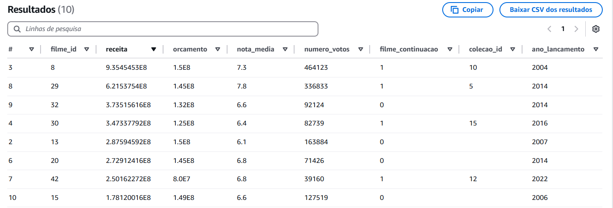

# Objetivo da Entrega 4

Criar no AWS Glue Catalog as tabelas e, se necessário, views, de acordo com modelagem de dados solicitada, a fim de disponibilizar os dados para a ferramenta de visualização (QuickSight, a partir da próxima sprint), a origem será os dados oriundos da *Trusted Zone* e o destino será na camada *Refined*.


[...]

# Etapas

- [Contextualização / Minha análise](#contextualização)

- [Preparação para a Modelagem](#preparação-para-a-modelagem)

- [Modelagem Multidimensional](#modelagem-multidimensional)

- [Processamento da camda Refined](#processamento-da-camada-refined)


[...]

# Contextualização

A camada *Refined* é a etapa onde os dados que foram processados e limpos na camada *Trusted* são filtrados e refinados para uma análise específica, arranjando os dados da melhor forma para o consumo final, como a criação de gráficos e relatórios com o objetivo de tirar insights desses dados.

Para a minha análise, que consiste no estudo de uma produtora expecífica, precisei análizar quais as colunas essenciais para minha análise e evitar levar dados que não serão usados causando custos desnecessários.


### Minha análise:

Tem o objetivo de investigar específicamente as produções da DreamWorks Animation, ajudando a entender se vale a pena investir em filmes originais ou continuações baseando-se na resposta do público sobre esses filmes e identificar os padrões de bilheteria e ROI desses filmes.

- *Quais são os filmes da DreamWorks com maior bilheteria?*

- *A bilheteria média de histórias originais é maior ou menor que a de continuações?*

- *Como as avaliações de uma franquia mudam ao longo do tempo conforme novas sequências são lançadas?*

- *Histórias originais, continuações e adaptações: quais têm as melhores avaliações?*

- *Qual o retorno sobre investimento (ROI) médio de histórias originais e continuações?*


[...]

# Preparação para a Modelagem

Comecei a formular como eu gostaria de modelar esses dados, primeiramente, comecei análilizando as colunas que eu possuia e separei quais seriam os dados que seriam necessários.

> **Dados da camada *Trusted*:**

| Parquet TMDB |  Parquet LOCAL |
|----------------------------------|---------------------|
| imdb_id: string (nullable = true) | id: string (nullable = true)
| title: string (nullable = true) | tituloPincipal: string (nullable = true)
| revenue: float (nullable = true) | tituloOriginal: string (nullable = true)
| budget: float (nullable = true) | anoLancamento: string (nullable = true)
| production_countries: array (nullable = true) | tempoMinutos: string (nullable = true)
| spoken_languages: array (nullable = true) | genero: string (nullable = true)
| status: string (nullable = true) | notaMedia: double (nullable = true)
| is_sequel: boolean (nullable = true) | numeroVotos: integer (nullable = true)
| collection_name: string (nullable = true) | generoArtista: string (nullable = true)
| | personagem: string (nullable = true)
| | nomeArtista: string (nullable = true)
| | anoNascimento: string (nullable = true)
| | anoFalecimento: string (nullable = true)
| | profissao: string (nullable = true)
| | titulosMaisConhecidos: string (nullable = true)


[...]


> **Colunas que precisarei para a minha análise**

colunas dos arquivos parquet, localizados na camada trusted, que precisarei para a minha análise final e que serão levadas para a camada refined.

| **LOCAL** | **TMDB** |
| --- | --- |
| id | imdb_id |
| titulo (tituloPrincipal)| receita (revenue) |
| ano_lancamento | orcamento (budget) |
| nota_media | filme_continuacao (is_sequel) |
| numero_votos | nome_colecao (collection_name) |

[...]


## MODELAGEM MULTIDIMENSIONAL:

Organizando/modelando os dados pensando no conceito de star schema, uma tabela fato central e as dimensões cercando ela, por ser a forma mais simples e eficaz de realizar a análise.
Para fazer o diagrama da minha modelagem utilizei o DBeaver.

- código para a criação das tabelas e conexões [aqui](../Desafio/entrega-4/dbeaver-diag-cod)


[...]

# Processamento da camada Refined

A partir do modelo que eu defini, desenvolvi o script no glue para criar as tabelas puxando os dados da camada Trusted e salvando os resutados como parquet na camada Refined.

- código: [Job do Glue](../Desafio/entrega-4/JobDreamworksRefined.py)


Importando as bibliotecas necessárias para o funcionamento das funções

```python
import sys
from awsglue.transforms import *
from awsglue.utils import getResolvedOptions
from pyspark.context import SparkContext
from awsglue.context import GlueContext
from awsglue.job import Job
from pyspark.sql import SparkSession
from pyspark.sql.functions import col, when, row_number, lit
from pyspark.sql.types import IntegerType, DecimalType
from pyspark.sql.window import Window
```


Iniciando a seção Spark e passando os parâmetros dos caminhos, como os inputs da camada Trusted (local e TMDB) e o caminho para a saída dos resultados, a camada Refined.

```python
args = getResolvedOptions(sys.argv, ['JOB_NAME', 'LOCAL_PATH', 'TMDB_PATH', 'REFINED_PATH'])

sc = SparkContext()
glueContext = GlueContext(sc)
spark = glueContext.spark_session
job = Job(glueContext)
job.init(args['JOB_NAME'], args)

input_local = args['LOCAL_PATH']
input_tmdb = args['TMDB_PATH']
output_refined = args['REFINED_PATH']
```

Lendo os arquivos da camada trusted como dataframes e excluindo as duplicatas dos dados locais basendo-se no ID, porque os dados desses arquivos estão particionados atores dos filmes, o que faz o id de um filme aparecer mais de uma vez. E criando a tabela de dimensão para as coleções de filmes e adicionando um id (identificado único) para essas coleções com a função "row_number()" dentro de uma janela ordenada por nome.

```python
local_df = spark.read.parquet(input_local).dropDuplicates(['id'])
tmdb_df = spark.read.parquet(input_tmdb)

# dimensão COLEÇÃO
window_colecao = Window.orderBy("nome_colecao")
dim_colecao = (
    tmdb_df.select(col("collection_name").alias("nome_colecao"))
    .distinct()
    .withColumn("colecao_id", row_number().over(window_colecao))
)
```


Realizando um JOIN interno entre o "local_df" e "tmdb_df" usando os id's do imdb que os dois dataframes possuem, assim permanecendo somente os filmes da dreamworks. E então criando a tabela de dimensão para os titulos dos filmes, sem duplicatas, e atribuindo um id para eles utilizando o "row_number" novamente.

```python
filmes_filtrados = local_df.join(tmdb_df, local_df.id == tmdb_df.imdb_id, "inner")

# Dimensão TÍTULOS
window_titulos = Window.orderBy("imdb_id")
dim_titulos = (
    filmes_filtrados.select(col("id").alias("imdb_id"), col("tituloPincipal").alias("titulo"))
    .distinct()
    .withColumn("filme_id", row_number().over(window_titulos))
)
```


Criando a tabela fato dos filmes unindo as dimensões criadas e os filmes filtrados da dreamworks. Converti os tipos das colunas de receita, orçamento, ano de lançamento para evitar erros e transformando os dados da coluna que afirma se o filmes é continuação de "True"/"False" para "1"/"0" para manter a fato com somente colunas numéricas.

```python
# tabela FATO
fato_filmes = (
    filmes_filtrados.join(dim_titulos, "imdb_id", "inner")
    .join(dim_colecao, filmes_filtrados.collection_name == dim_colecao.nome_colecao, "left")
    .select(
        col("filme_id"),
        col("revenue").cast(DecimalType(18, 2)).alias("receita"),
        col("budget").cast(DecimalType(18, 2)).alias("orcamento"),
        col("anoLancamento").cast("int").alias("ano_lancamento"),
        col("notaMedia").alias("nota_media"),
        col("numeroVotos").alias("numero_votos"),
        when(col("is_sequel"), 1).otherwise(0).alias("filme_continuacao"),
        col("colecao_id") 
    )
)
```


Escrevendo as tabelas como arquivos parquet na camada refined e dentro de uma pasta com o nome da tabela, e salvando a fato_filmes particionado pela coluna de ano do lançamento para facilitar nas consultas temporais.

```python
fato_filmes.write.partitionBy("ano_lancamento").parquet(f"{output_refined}/fato_filmes", mode='overwrite')
dim_titulos.write.parquet(f"{output_refined}/dim_titulos", mode='overwrite')
dim_colecao.write.parquet(f"{output_refined}/dim_colecao", mode='overwrite')

job.commit()
```


[...]

### Executando o Job

- Antes de qualquer coisa criei um database no *AWS Lake Formation* com o nome "dreamworksRefined" utilizando a mesma função do *I AM* que criei na sprint passada com o nome "GlueDesafioFinal". 


- Executei o Job com as configurações pedidas nas instruções, e após alguns pequenos ajustes ele foi executado com sucesso.


### Estrutura do Bucket

- Caminho das pastas criadas com a execução do Job:


### Crawler

- Criei um crawler apontando para a camada Refined, criando as três tabelas 


- Execução bem sucedido


- E as tabelas já aparecem no database dreamworksRefined:


### Athena

- Visualizando a tabela dim_colecao:


- Visualizando a tabela dim_titulo:


- Quando eu visualizei a tabela fato na primeira execução percebi que o formato dos dados de receita e orçamento estavam estranhos, então voltei para o job e defini o tipo das duas colunas como ".cast(DecimalType(18, 2))"




- Após executar o job depois de definir o tipo como decimal eles já apareceram normalmente na tabela:

